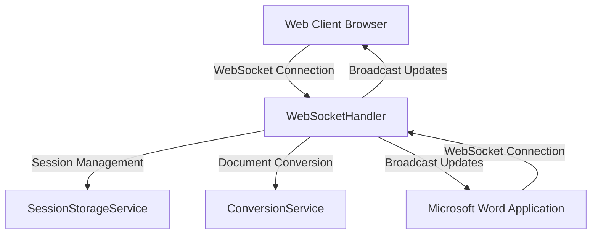
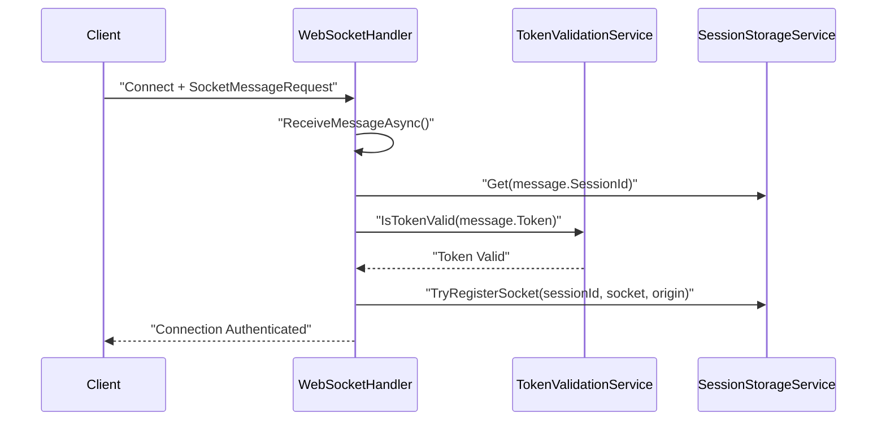
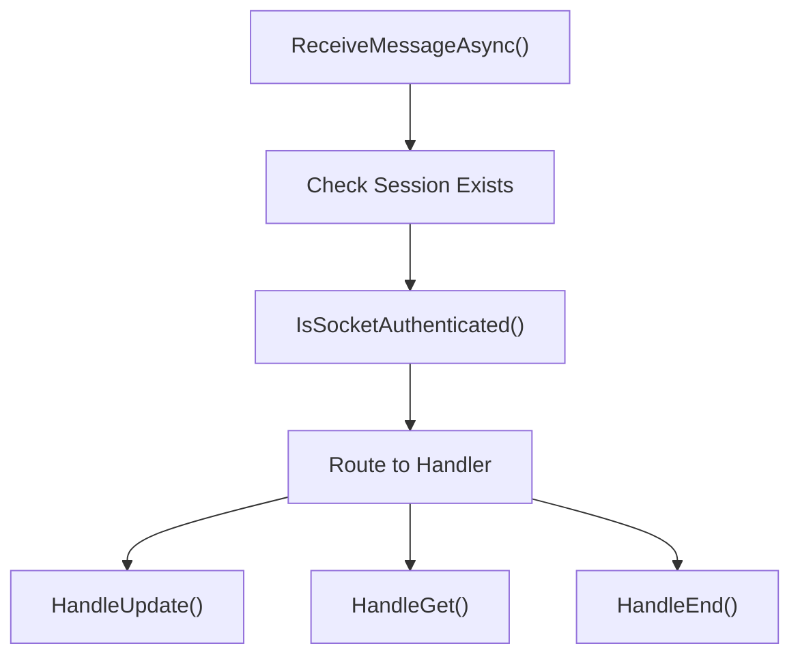
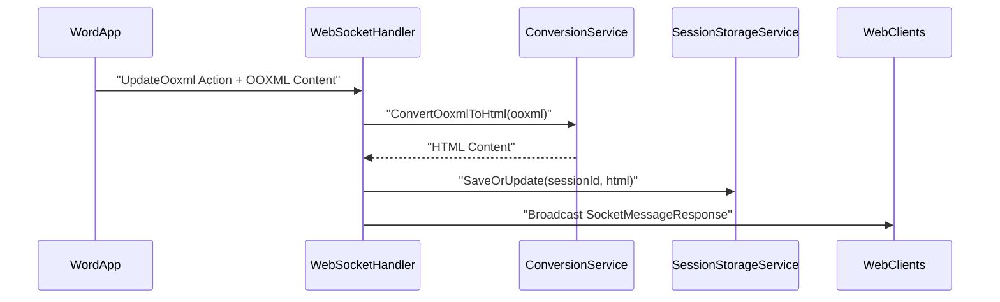
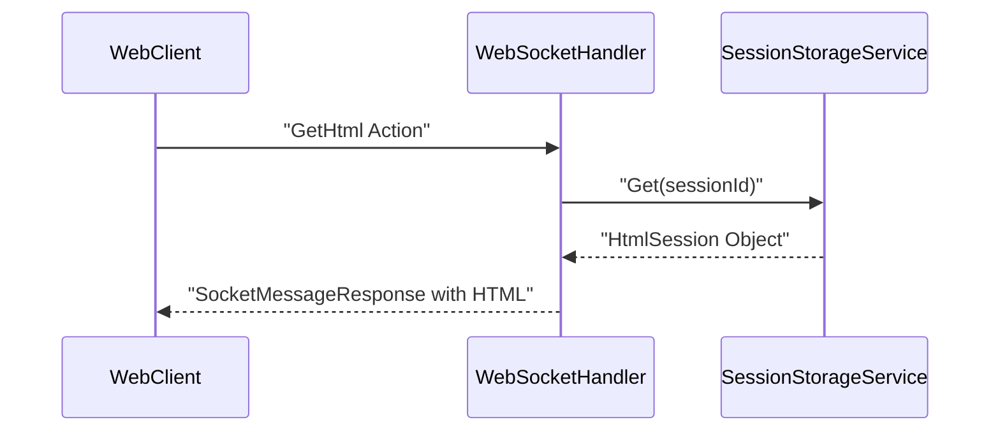
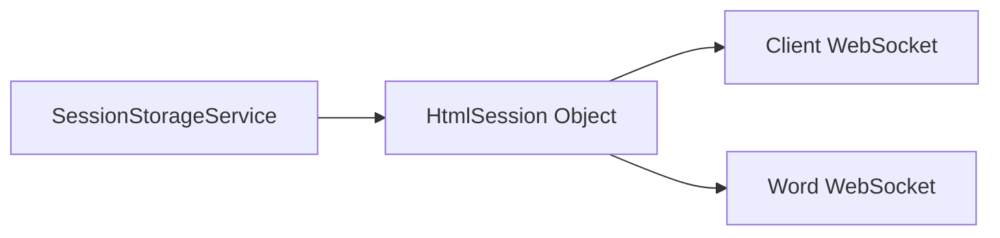
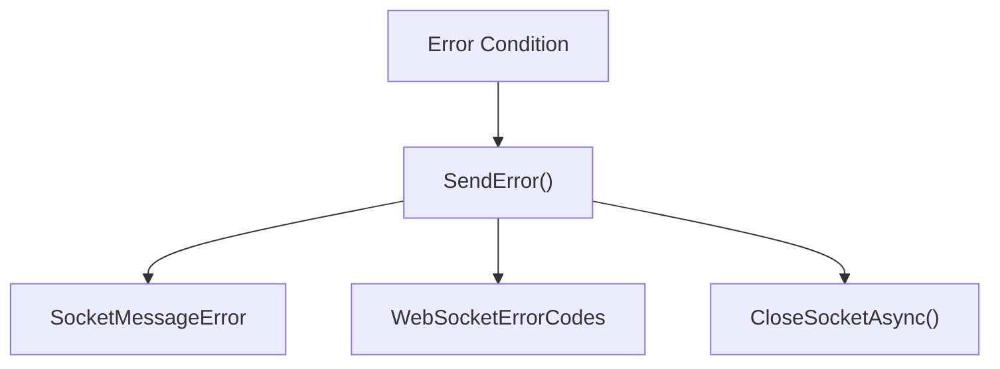

# Real-time Communication

Relevant source files

The following files were used as context for generating this wiki page:

- [WebSockets/Constants.cs](WebSockets/Constants.cs)
- [WebSockets/WebSocketHandler.cs](WebSockets/WebSocketHandler.cs)

## Purpose and Scope

This document explains the real-time communication system that enables live collaboration between web clients and Microsoft Word applications. The WebSocket-based architecture allows for bidirectional, low-latency communication to synchronize document changes in real-time.

For detailed implementation of the WebSocket message handler, see [WebSocket Handler](#5.1). For the specific message format and protocol specification, see [WebSocket Protocol](#5.2).

## Architecture Overview

The real-time communication system is built around WebSocket connections that connect multiple clients to shared document sessions. The system supports two primary client types: web browsers and Microsoft Word applications, both communicating through the `WebSocketHandler` class.

### Core Communication Flow

Sources: [WebSockets/WebSocketHandler.cs:12-33]()

The `WebSocketHandler` serves as the central hub for all real-time communication, managing connections from both web clients and Word applications while coordinating with session storage and document conversion services.

## WebSocket Connection Lifecycle

### Connection Establishment and Authentication

Sources: [WebSockets/WebSocketHandler.cs:54-90]()

Every WebSocket connection must provide a valid authentication token and session ID in the initial message. The `TokenValidationService` validates the token before the socket is registered with the `SessionStorageService` using the `TryRegisterSocket` method.

### Message Processing Loop

The `WebSocketHandler` maintains an active message processing loop for each connected socket:

Sources: [WebSockets/WebSocketHandler.cs:92-133](), [WebSockets/WebSocketHandler.cs:27-32]()

## WebSocket Actions and Message Types

The system defines specific action types in the `WebSocketActions` class that determine how messages are processed:

| Action | Constant | Handler Method | Purpose |
|--------|----------|----------------|---------|
| Update OOXML | `UpdateOoxml` | `HandleUpdate()` | Process document changes from Word |
| Get HTML | `GetHtml` | `HandleGet()` | Retrieve current HTML content |
| End Session | `EndSession` | `HandleEnd()` | Terminate session and cleanup |
| Session Closed | `SessionClosed` | N/A | Server notification of closure |
| Initialize | `Init` | N/A | Initial connection setup |

Sources: [WebSockets/Constants.cs:3-11](), [WebSockets/WebSocketHandler.cs:154-241]()

### Origin-based Message Routing

Messages are tagged with origin identifiers from the `Origins` class to track their source:

- **`Origins.Word`**: Messages from Microsoft Word applications
- **`Origins.Client`**: Messages from web browser clients  
- **`Origins.Server`**: Server-generated responses and notifications

Sources: [WebSockets/Constants.cs:19-24]()

## Document Synchronization Patterns

### Word-to-Browser Updates

Sources: [WebSockets/WebSocketHandler.cs:154-192]()

When Word sends OOXML updates through the `UpdateOoxml` action, the system converts the content to HTML using `ConversionService.ConvertOoxmlToHtml()` and broadcasts the result to all connected clients in the session.

### Client HTML Requests

Sources: [WebSockets/WebSocketHandler.cs:194-218]()

Web clients can request the current HTML content using the `GetHtml` action, which retrieves the stored HTML from the session and returns it in a `SocketMessageResponse`.

## Session Management Integration

The real-time communication system integrates tightly with session management through the `SessionStorageService`:

### Socket Registration by Origin

Sources: [WebSockets/WebSocketHandler.cs:89](), [WebSockets/WebSocketHandler.cs:144]()

Each session can maintain separate WebSocket connections for web clients and Word applications. The `TryRegisterSocket` method associates sockets with sessions based on their origin, and `UnregisterSocket` cleans up connections when they close.

## Error Handling and Resilience

### WebSocket Error Response System

The system uses structured error responses through `SocketMessageError` objects when problems occur:

Sources: [WebSockets/WebSocketHandler.cs:258-270](), [WebSockets/WebSocketHandler.cs:273-291]()

Common error scenarios include:
- **Session Not Found**: When a session ID is invalid or expired
- **Invalid Token**: When authentication fails
- **Socket Not Authenticated**: When an unauthenticated socket attempts actions
- **Conversion Error**: When OOXML to HTML conversion fails
- **Message Processing Error**: When unexpected exceptions occur

### Connection Cleanup

The `WebSocketHandler` ensures proper cleanup in the `finally` block of the main handling loop:

1. Unregister the socket from the session using `UnregisterSocket()`
2. Send a `SessionClosed` notification if the socket is still open
3. Close the WebSocket connection gracefully with `CloseSocketAsync()`

Sources: [WebSockets/WebSocketHandler.cs:141-151]()

This cleanup process ensures that sessions don't accumulate stale socket references and that clients are properly notified when connections terminate.