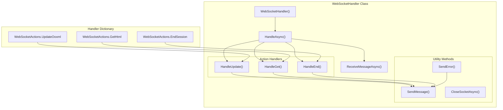
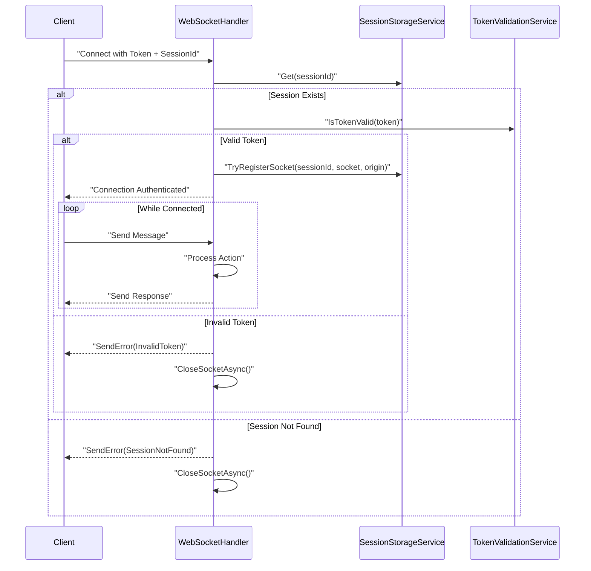
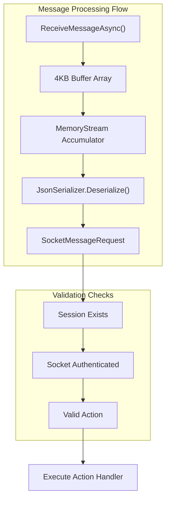
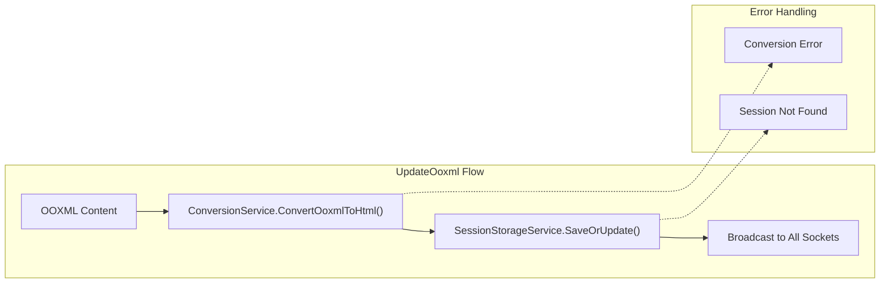
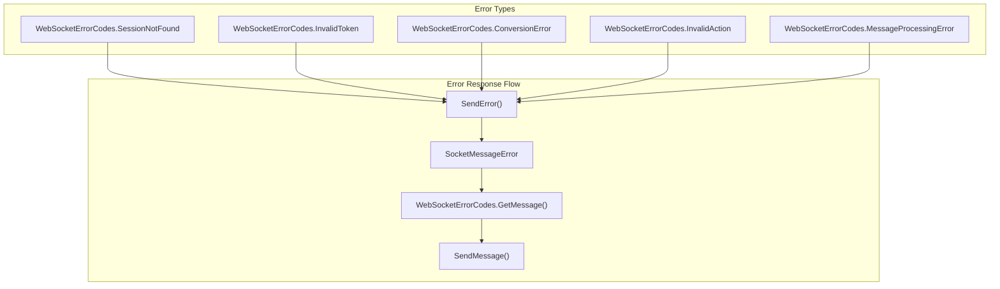

# WebSocket Handler

Relevant source files

The following files were used as context for generating this wiki page:

- [Interfaces/ISocketMessage.cs](Interfaces/ISocketMessage.cs)
- [Models/SocketMessageRequest.cs](Models/SocketMessageRequest.cs)
- [WebSockets/WebSocketHandler.cs](WebSockets/WebSocketHandler.cs)

## Purpose and Scope

The WebSocket Handler is the core component responsible for managing real-time WebSocket connections between clients and the document conversion service. It facilitates live collaboration by handling bidirectional communication for document updates, HTML retrieval, and session management.

This document covers the `WebSocketHandler` class implementation, connection lifecycle, message processing patterns, and integration with session storage and conversion services. For WebSocket message format and protocol specifications, see [WebSocket Protocol](#5.2). For session management details, see [Session Management](#4.2).

## Class Overview and Dependencies

The `WebSocketHandler` class serves as the central orchestrator for WebSocket communication, managing authentication, message routing, and real-time document synchronization.

### Core Dependencies

| Dependency | Purpose | Integration Point |
|------------|---------|-------------------|
| `SessionStorageService` | Session state management | Socket registration and HTML storage |
| `ConversionService` | Document format conversion | OOXML to HTML conversion |
| `TokenValidationService` | Authentication validation | Initial connection authentication |
| `SystemEventLogger` | Event logging | Connection events and error tracking |

### Message Handlers

The WebSocket handler uses a dictionary-based action routing system to process different message types:

Sources: [WebSockets/WebSocketHandler.cs:12-33]()

## Connection Lifecycle

### Initial Connection and Authentication

The WebSocket connection follows a strict authentication and registration flow:

The authentication process validates both session existence and token validity before registering the socket:

- **Session Validation**: Checks if the session exists in `SessionStorageService` [WebSockets/WebSocketHandler.cs:63-70]()
- **Token Authentication**: Validates the provided token using `TokenValidationService` [WebSockets/WebSocketHandler.cs:73-86]()  
- **Socket Registration**: Registers the authenticated socket with the session based on origin [WebSockets/WebSocketHandler.cs:89]()

Sources: [WebSockets/WebSocketHandler.cs:54-91]()

## Message Processing Architecture

### Message Reception and Validation

The handler implements a buffered message reception system that supports variable-length WebSocket messages:

The message processing loop continues until the WebSocket connection closes, with each message undergoing validation:

- **Session Existence**: Verifies the session hasn't expired [WebSockets/WebSocketHandler.cs:100-106]()
- **Socket Authentication**: Ensures the socket is properly authenticated [WebSockets/WebSocketHandler.cs:109-115]()
- **Action Routing**: Maps actions to handler methods using the handlers dictionary [WebSockets/WebSocketHandler.cs:118-126]()

Sources: [WebSockets/WebSocketHandler.cs:35-52](), [WebSockets/WebSocketHandler.cs:92-133]()

## Action Handlers

### UpdateOoxml Handler

The `HandleUpdate` method processes OOXML content from Microsoft Word and broadcasts HTML updates to all connected clients:

Key operations:
- Converts OOXML to HTML using `ConversionService` [WebSockets/WebSocketHandler.cs:166]()
- Updates session storage with new HTML content [WebSockets/WebSocketHandler.cs:174]()
- Broadcasts HTML to all active sockets in the session [WebSockets/WebSocketHandler.cs:188-191]()

### GetHtml Handler

The `HandleGet` method retrieves current HTML content for a specific client:

- Validates session existence [WebSockets/WebSocketHandler.cs:198-203]()
- Returns stored HTML content to requesting socket [WebSockets/WebSocketHandler.cs:207-217]()

### EndSession Handler

The `HandleEnd` method terminates a session and notifies all connected clients:

- Broadcasts session closure to all active sockets [WebSockets/WebSocketHandler.cs:234-237]()
- Removes session from storage [WebSockets/WebSocketHandler.cs:239]()
- Logs session cleanup [WebSockets/WebSocketHandler.cs:240]()

Sources: [WebSockets/WebSocketHandler.cs:154-241]()

## Error Handling and Response System

### Error Code Integration

The WebSocket handler integrates with the centralized error code system for consistent error responses:

### Connection Closure Handling

The handler implements graceful connection closure with proper cleanup:

- Sends closure notification to client [WebSockets/WebSocketHandler.cs:284-285]()
- Closes WebSocket with normal status [WebSockets/WebSocketHandler.cs:286]()
- Unregisters socket from session storage [WebSockets/WebSocketHandler.cs:144]()
- Logs closure event [WebSockets/WebSocketHandler.cs:288]()

Sources: [WebSockets/WebSocketHandler.cs:258-270](), [WebSockets/WebSocketHandler.cs:273-291]()

## Service Integration Points

### SessionStorageService Integration

The WebSocket handler heavily integrates with session storage for state management:

| Method | Purpose | Usage in Handler |
|--------|---------|------------------|
| `Get(sessionId)` | Retrieve session data | Initial validation and HTML retrieval |
| `Exists(sessionId)` | Check session existence | Message processing validation |
| `TryRegisterSocket()` | Register authenticated socket | Connection establishment |
| `IsSocketAuthenticated()` | Verify socket authentication | Message processing security |
| `GetActiveSockets()` | Get all session sockets | Broadcasting updates |
| `SaveOrUpdate()` | Store HTML content | After OOXML conversion |
| `RemoveSession()` | Clean up session | Session termination |

### ConversionService Integration

Document conversion is handled through the `ConversionService`:

- **OOXML to HTML**: Converts Word document changes to HTML format [WebSockets/WebSocketHandler.cs:166]()
- **Error Handling**: Processes conversion errors and sends appropriate error responses [WebSockets/WebSocketHandler.cs:167-172]()

### TokenValidationService Integration

Authentication is managed through token validation:

- **Initial Authentication**: Validates tokens during connection establishment [WebSockets/WebSocketHandler.cs:80]()
- **Security Enforcement**: Ensures only valid tokens can establish connections

Sources: [WebSockets/WebSocketHandler.cs:14-25](), [WebSockets/WebSocketHandler.cs:63](), [WebSockets/WebSocketHandler.cs:89](), [WebSockets/WebSocketHandler.cs:109](), [WebSockets/WebSocketHandler.cs:166](), [WebSockets/WebSocketHandler.cs:174](), [WebSockets/WebSocketHandler.cs:188](), [WebSockets/WebSocketHandler.cs:239]()