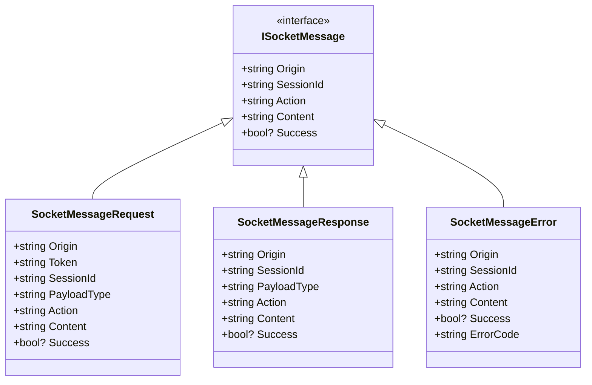
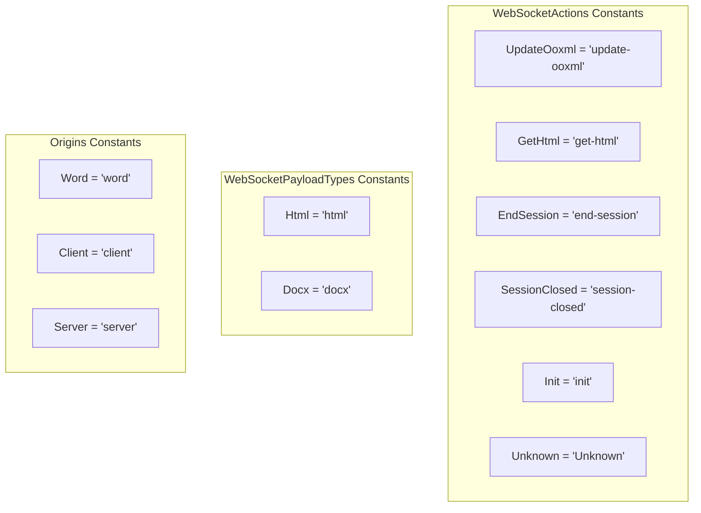
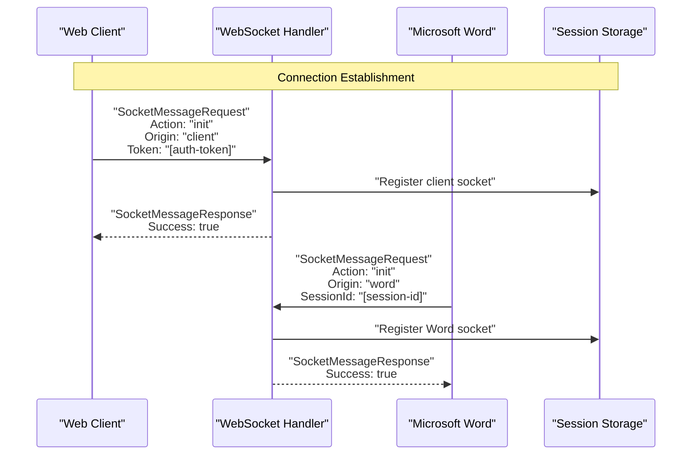
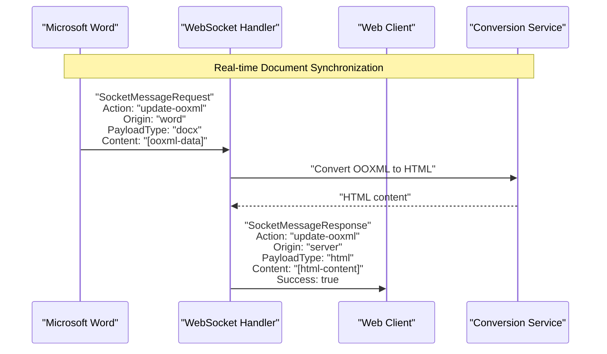
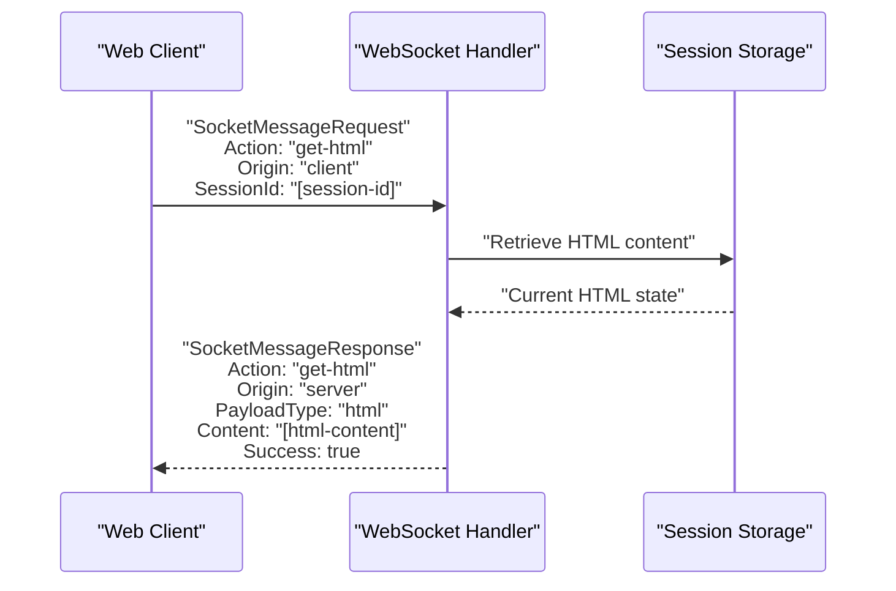
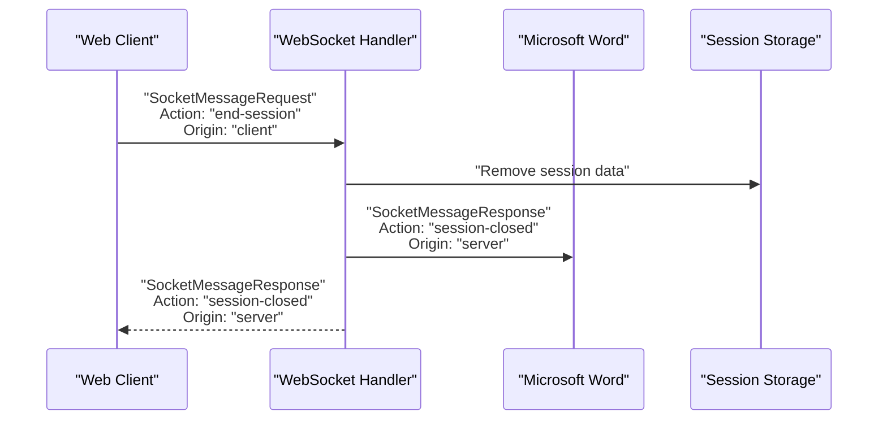
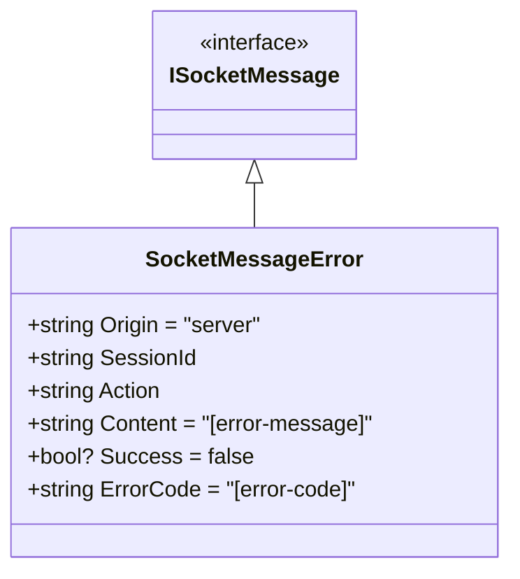
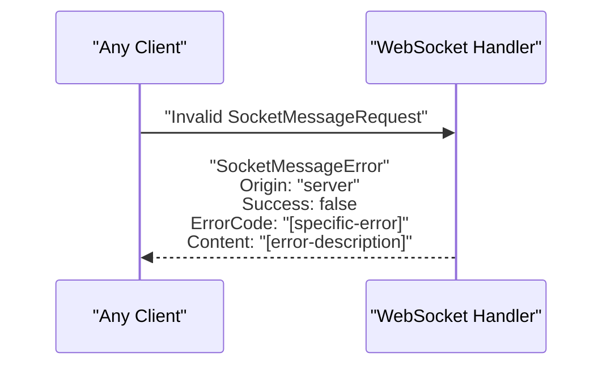

# WebSocket Protocol

<details>
<summary>Relevant source files</summary>

The following files were used as context for generating this wiki page:

- [Interfaces/ISocketMessage.cs](Interfaces/ISocketMessage.cs)
- [Models/SocketMessageRequest.cs](Models/SocketMessageRequest.cs)
- [WebSockets/Constants.cs](WebSockets/Constants.cs)

</details>


This document defines the WebSocket message format, actions, and communication patterns used for real-time document collaboration between web clients, Microsoft Word applications, and the server. The protocol enables live synchronization of document changes and session management across multiple connected clients.

For implementation details of how these messages are processed, see [WebSocket Handler](#5.1). For error handling specific to WebSocket communications, see [WebSocket Error Codes](#6.2).

## Message Structure

The WebSocket protocol uses a standardized message format based on the `ISocketMessage` interface. All messages exchanged between clients and the server follow this structure, with specific implementations for requests, responses, and errors.

### Core Message Interface



**Sources:** [Interfaces/ISocketMessage.cs:1-11](), [Models/SocketMessageRequest.cs:1-37]()

### Message Properties

| Property | Type | Description |
|----------|------|-------------|
| `Origin` | string | Identifies the sender: "word", "client", or "server" |
| `SessionId` | string | Unique identifier linking the message to a specific session |
| `Action` | string | The operation being requested or performed |
| `Content` | string | The message payload (HTML, OOXML, etc.) |
| `Success` | bool? | Indicates operation success/failure |
| `Token` | string | Authentication token (requests only) |
| `PayloadType` | string | Content type: "html" or "docx" |
| `ErrorCode` | string | Specific error identifier (errors only) |

**Sources:** [Interfaces/ISocketMessage.cs:4-9](), [Models/SocketMessageRequest.cs:7-13](), [Models/SocketMessageRequest.cs:17-24](), [Models/SocketMessageRequest.cs:29-35]()

## Actions and Constants

The protocol defines specific actions and constants that control the behavior of WebSocket communications. These are centralized in the `WebSocketActions`, `WebSocketPayloadTypes`, and `Origins` classes.

### Available Actions



**Sources:** [WebSockets/Constants.cs:3-25]()

### Action Descriptions

| Action | Origin | Purpose | Payload Type |
|--------|--------|---------|--------------|
| `update-ooxml` | Word | Send document changes from Word to server | docx |
| `get-html` | Client | Request current HTML content from server | html |
| `end-session` | Client/Word | Terminate the current session | N/A |
| `session-closed` | Server | Notify clients that session has ended | N/A |
| `init` | Client/Word | Initialize WebSocket connection | N/A |

**Sources:** [WebSockets/Constants.cs:5-10]()

## Communication Patterns

The WebSocket protocol supports bidirectional communication between multiple client types and the server, enabling real-time document synchronization.

### Session Initialization Flow



**Sources:** [WebSockets/Constants.cs:9](), [Models/SocketMessageRequest.cs:5-14](), [Models/SocketMessageRequest.cs:16-24]()

### Document Update Flow



**Sources:** [WebSockets/Constants.cs:5](), [WebSockets/Constants.cs:15-16](), [Models/SocketMessageRequest.cs:5-14]()

### HTML Request Flow



**Sources:** [WebSockets/Constants.cs:6](), [WebSockets/Constants.cs:15](), [Models/SocketMessageRequest.cs:5-14]()

### Session Termination Flow



**Sources:** [WebSockets/Constants.cs:7-8](), [Models/SocketMessageRequest.cs:5-14]()

## Error Handling

When errors occur during WebSocket communication, the server responds with `SocketMessageError` objects that include specific error codes for debugging and localization.

### Error Message Structure



**Sources:** [Models/SocketMessageRequest.cs:27-35]()

### Error Response Pattern



**Sources:** [Models/SocketMessageRequest.cs:27-35]()

## Message Examples

### Successful HTML Update from Word

```json
{
  "Origin": "word",
  "SessionId": "session-123",
  "PayloadType": "docx",
  "Action": "update-ooxml",
  "Content": "[base64-encoded-ooxml]",
  "Success": true
}
```

### HTML Content Request

```json
{
  "Origin": "client",
  "Token": "auth-token-xyz",
  "SessionId": "session-123",
  "Action": "get-html",
  "Content": "",
  "Success": null
}
```

### Error Response

```json
{
  "Origin": "server",
  "SessionId": "session-123",
  "Action": "get-html",
  "Content": "Session not found",
  "Success": false,
  "ErrorCode": "E1001"
}
```

**Sources:** [Models/SocketMessageRequest.cs:5-14](), [Models/SocketMessageRequest.cs:16-24](), [Models/SocketMessageRequest.cs:27-35]()