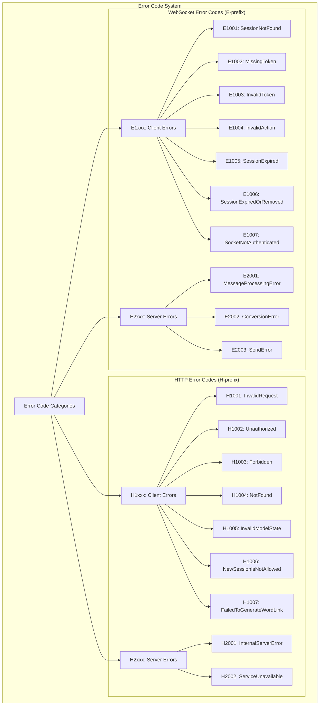
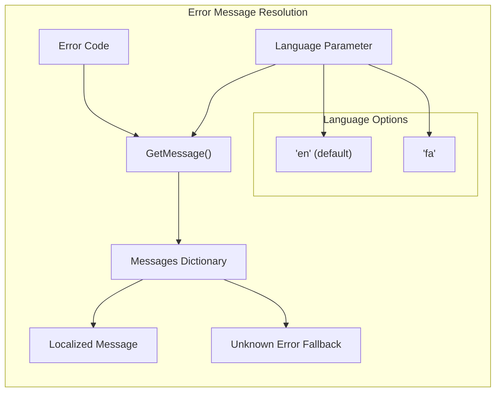
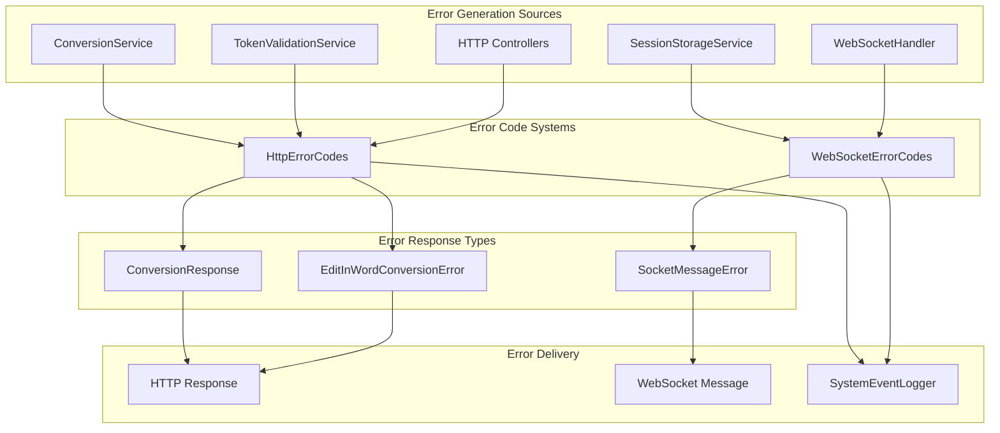

# Error Handling

<details>
<summary>Relevant source files</summary>

The following files were used as context for generating this wiki page:

- [Exceptions/HttpErrorCodes.cs](Exceptions/HttpErrorCodes.cs)
- [Exceptions/WebSocketErrorCodes.cs](Exceptions/WebSocketErrorCodes.cs)

</details>


This document provides a comprehensive overview of the error handling system in IstgHtmlDocxConvertService. It covers the standardized error code system, response patterns, and localization support used throughout the service for both HTTP API operations and WebSocket communication.

For detailed information about specific error codes, see [HTTP Error Codes](#6.1) and [WebSocket Error Codes](#6.2). For information about the logging system that captures these errors, see [Logging System](#7.2).

## Error Code Architecture

The service implements a structured error handling system with two primary error code categories: HTTP errors for REST API operations and WebSocket errors for real-time communication. Both systems follow consistent patterns and provide bilingual error messaging.

### Error Code Taxonomy



**Sources:** [Exceptions/HttpErrorCodes.cs:5-17](), [Exceptions/WebSocketErrorCodes.cs:5-14]()

## Error Code Structure

Both error code systems follow a consistent structure with categorized numeric codes and bilingual messaging support.

| System | Prefix | Client Errors | Server Errors | Language Support |
|--------|--------|---------------|---------------|------------------|
| HTTP API | H | H1xxx | H2xxx | Farsi, English |
| WebSocket | E | E1xxx | E2xxx | Farsi, English |

### HTTP Error Categories

| Error Code | Category | Description |
|------------|----------|-------------|
| H1001 | Client | Invalid request format or parameters |
| H1002 | Client | Missing or invalid authentication |
| H1003 | Client | Insufficient permissions |
| H1004 | Client | Requested resource not found |
| H1005 | Client | Model validation failed |
| H1006 | Client | Session creation not permitted |
| H1007 | Client | Word link generation failed |
| H2001 | Server | Internal processing error |
| H2002 | Server | Service temporarily unavailable |

**Sources:** [Exceptions/HttpErrorCodes.cs:7-16]()

### WebSocket Error Categories

| Error Code | Category | Description |
|------------|----------|-------------|
| E1001 | Client | Session not found in storage |
| E1002 | Client | Authentication token missing |
| E1003 | Client | Authentication token invalid |
| E1004 | Client | Unknown or invalid action |
| E1005 | Client | Session has expired |
| E1006 | Client | Session expired or manually removed |
| E1007 | Client | WebSocket connection not authenticated |
| E2001 | Server | Error processing WebSocket message |
| E2002 | Server | Document conversion failed |
| E2003 | Server | Error sending WebSocket message |

**Sources:** [Exceptions/WebSocketErrorCodes.cs:5-14]()

## Localization System

The error handling system provides comprehensive bilingual support for both Farsi and English languages through structured message dictionaries.

### Message Resolution Flow



**Sources:** [Exceptions/HttpErrorCodes.cs:32-38](), [Exceptions/WebSocketErrorCodes.cs:30-36]()

### Error Message Implementation

Both `HttpErrorCodes` and `WebSocketErrorCodes` classes implement identical message resolution patterns:

```csharp
// Method signature pattern used in both classes
public static string GetMessage(string code, string lang = "en")
```

The message resolution follows this logic:
1. Check if error code exists in message dictionary
2. Return appropriate language message (Farsi or English)
3. Fall back to "Unknown error" message if code not found
4. Default language is English when not specified

**Sources:** [Exceptions/HttpErrorCodes.cs:32-38](), [Exceptions/WebSocketErrorCodes.cs:30-36]()

## Error Response Integration

The error code system integrates with the service's response patterns and logging infrastructure to provide consistent error handling across all communication channels.

### Error Handling Flow



**Sources:** [Exceptions/HttpErrorCodes.cs:1-40](), [Exceptions/WebSocketErrorCodes.cs:1-38]()

## Error Code Usage Patterns

### HTTP API Error Handling

HTTP errors are primarily used in controller responses and service validation:

- **Authentication Errors**: `H1002` (Unauthorized), `H1003` (Forbidden)
- **Validation Errors**: `H1001` (InvalidRequest), `H1005` (InvalidModelState)
- **Resource Errors**: `H1004` (NotFound)
- **Business Logic Errors**: `H1006` (NewSessionIsNotAllowed), `H1007` (FailedToGenerateWordLink)
- **System Errors**: `H2001` (InternalServerError), `H2002` (ServiceUnavailable)

### WebSocket Error Handling

WebSocket errors handle real-time communication failures and session management:

- **Session Errors**: `E1001` (SessionNotFound), `E1005` (SessionExpired), `E1006` (SessionExpiredOrRemoved)
- **Authentication Errors**: `E1002` (MissingToken), `E1003` (InvalidToken), `E1007` (SocketNotAuthenticated)
- **Protocol Errors**: `E1004` (InvalidAction)
- **Processing Errors**: `E2001` (MessageProcessingError), `E2002` (ConversionError), `E2003` (SendError)

**Sources:** [Exceptions/HttpErrorCodes.cs:19-30](), [Exceptions/WebSocketErrorCodes.cs:16-28]()

## Error Code Constants

Both error code classes use static constants for type-safe error code references throughout the codebase:

### HTTP Error Code Constants
- Defined in `HttpErrorCodes.Codes` nested class
- Pattern: String constants with descriptive names
- Example: `public const string InvalidRequest = "H1001"`

### WebSocket Error Code Constants  
- Defined directly in `WebSocketErrorCodes` class
- Pattern: String constants with descriptive names
- Example: `public const string SessionNotFound = "E1001"`

This approach ensures compile-time checking of error codes and prevents typos in error code usage throughout the service.

**Sources:** [Exceptions/HttpErrorCodes.cs:5-17](), [Exceptions/WebSocketErrorCodes.cs:5-14]()