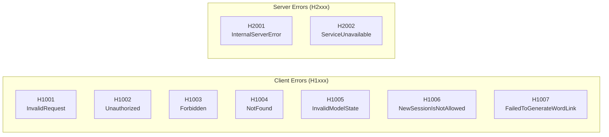
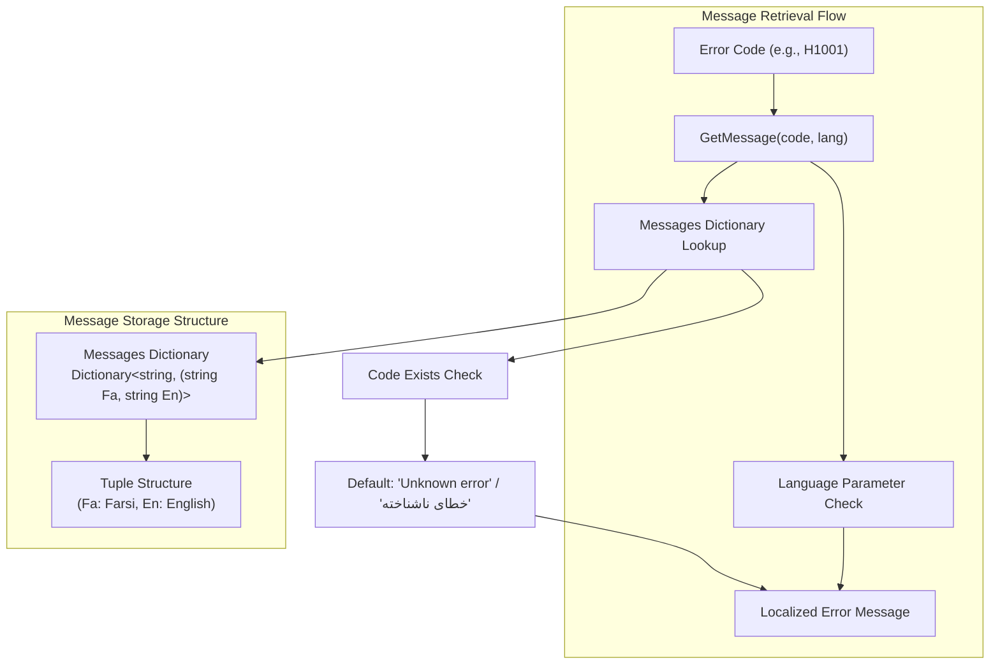

# HTTP Error Codes

<details>
<summary>Relevant source files</summary>

The following files were used as context for generating this wiki page:

- [Exceptions/HttpErrorCodes.cs](Exceptions/HttpErrorCodes.cs)

</details>


This document describes the HTTP error code system used by the IstgHtmlDocxConvertService for standardized error reporting across REST API endpoints. The system provides structured error codes with localized messages in both English and Farsi.

For WebSocket-specific error handling, see [WebSocket Error Codes](#6.2). For general error handling patterns and response structures, see [Error Handling](#6).

## Error Code Architecture

The HTTP error code system is implemented as a centralized static class that defines structured error codes with multilingual support.

```mermaid
graph TB
    subgraph HttpErrorCodes["HttpErrorCodes Class"]
        CodesNested["Codes (Nested Class)"]
        MessagesDict["Messages Dictionary"]
        GetMessageMethod["GetMessage() Method"]
    end
    
    subgraph ErrorCategories["Error Categories"]
        H1xxx["H1xxx: Client Errors"]
        H2xxx["H2xxx: Server Errors"]
    end
    
    subgraph LocalizationSupport["Localization Support"]
        FarsiMessages["Farsi Messages"]
        EnglishMessages["English Messages"]
        LanguageParam["Language Parameter"]
    end
    
    CodesNested --> H1xxx
    CodesNested --> H2xxx
    MessagesDict --> FarsiMessages
    MessagesDict --> EnglishMessages
    GetMessageMethod --> LanguageParam
    GetMessageMethod --> MessagesDict
    
    H1xxx --> InvalidRequest["H1001: InvalidRequest"]
    H1xxx --> Unauthorized["H1002: Unauthorized"]
    H1xxx --> Forbidden["H1003: Forbidden"]
    H1xxx --> NotFound["H1004: NotFound"]
    H1xxx --> InvalidModelState["H1005: InvalidModelState"]
    H1xxx --> NewSessionIsNotAllowed["H1006: NewSessionIsNotAllowed"]
    H1xxx --> FailedToGenerateWordLink["H1007: FailedToGenerateWordLink"]
    
    H2xxx --> InternalServerError["H2001: InternalServerError"]
    H2xxx --> ServiceUnavailable["H2002: ServiceUnavailable"]
```



Sources: [Exceptions/HttpErrorCodes.cs:1-40]()

## Error Code Structure

The HTTP error codes follow a hierarchical numbering system that categorizes errors by responsibility:

- **H1xxx**: Client-side errors (4xx HTTP status codes)
- **H2xxx**: Server-side errors (5xx HTTP status codes)



Sources: [Exceptions/HttpErrorCodes.cs:7-16]()

## Localization System

The error code system provides bilingual support with messages in both Farsi and English, implemented through a dictionary structure and retrieval method.



Sources: [Exceptions/HttpErrorCodes.cs:19-38]()

## Error Code Reference

| Error Code | Constant Name | English Message | Farsi Message | Typical Usage |
|------------|---------------|-----------------|---------------|---------------|
| H1001 | `InvalidRequest` | Invalid request | درخواست نامعتبر | Malformed request data |
| H1002 | `Unauthorized` | Unauthorized access | دسترسی غیرمجاز | Authentication failure |
| H1003 | `Forbidden` | Forbidden | دسترسی غیرمجاز | Authorization failure |
| H1004 | `NotFound` | Not found | یافت نشد | Resource not found |
| H1005 | `InvalidModelState` | Invalid input data | داده‌های ورودی نامعتبر است | Model validation errors |
| H1006 | `NewSessionIsNotAllowed` | Generating new session is not allowed | ایجاد نشست جدید مجاز نمی باشد | Session creation restrictions |
| H1007 | `FailedToGenerateWordLink` | Failed to generate word link | تولید لینک فایل وورد با خطا مواجه شد | Word integration failures |
| H2001 | `InternalServerError` | Internal server error | خطای داخلی سرور | Unhandled server exceptions |
| H2002 | `ServiceUnavailable` | Service unavailable | سرویس در دسترس نیست | Service outages |

Sources: [Exceptions/HttpErrorCodes.cs:7-16](), [Exceptions/HttpErrorCodes.cs:21-29]()

## Implementation Details

The `HttpErrorCodes` class is implemented as a static utility class with the following key components:

### Constants Definition
Error codes are defined as string constants in the nested `Codes` class, ensuring type safety and preventing magic strings throughout the codebase.

### Message Dictionary
The `Messages` dictionary maps error codes to tuples containing both Farsi and English translations, enabling runtime language selection.

### Message Retrieval
The `GetMessage` method provides safe access to localized error messages with fallback handling for unknown error codes.

```csharp
// Example usage pattern
string errorCode = HttpErrorCodes.Codes.InvalidRequest;
string message = HttpErrorCodes.GetMessage(errorCode, "en");
```

Sources: [Exceptions/HttpErrorCodes.cs:32-38]()

## Error Code Usage Pattern

The error codes are designed to be used consistently across all HTTP API responses in the service, providing:

1. **Structured Error Identification**: Each error has a unique alphanumeric code
2. **Client-Server Error Distinction**: H1xxx vs H2xxx categorization
3. **Internationalization**: Built-in support for multiple languages
4. **Fallback Handling**: Graceful degradation for unknown error codes

This system enables clients to programmatically handle specific error conditions while providing human-readable messages in the user's preferred language.

Sources: [Exceptions/HttpErrorCodes.cs:1-40]()