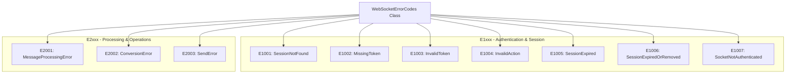
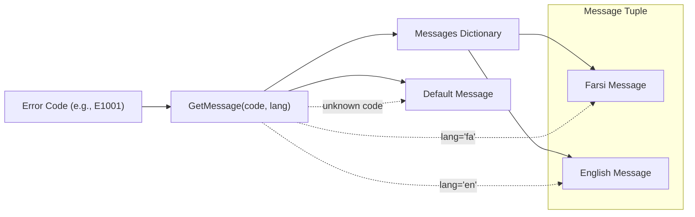
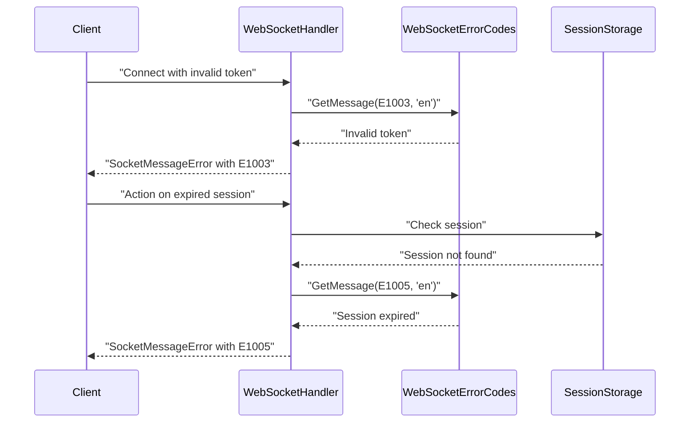

# WebSocket Error Codes

<details>
<summary>Relevant source files</summary>

The following files were used as context for generating this wiki page:

- [Exceptions/WebSocketErrorCodes.cs](Exceptions/WebSocketErrorCodes.cs)

</details>


This document covers the WebSocket error code system used for real-time communication errors in the IstgHtmlDocxConvertService. These error codes are specifically designed for WebSocket connections and differ from the HTTP error codes used for REST API endpoints. For HTTP error codes, see [HTTP Error Codes](#6.1). For general WebSocket communication patterns, see [WebSocket Protocol](#5.2).

## Error Code Structure

The WebSocket error code system uses a structured approach with alphanumeric codes that categorize different types of errors. All WebSocket error codes follow the pattern `E{category}{number}` where:

- `E` indicates a WebSocket error (distinct from HTTP codes)
- Category `1xxx` represents authentication and session-related errors
- Category `2xxx` represents processing and operational errors



**Sources:** [Exceptions/WebSocketErrorCodes.cs:1-38]()

## Authentication and Session Errors (E1xxx)

These error codes handle issues related to user authentication, session management, and WebSocket connection validation.

| Error Code | Constant Name | English Message | Farsi Message |
|------------|---------------|-----------------|---------------|
| E1001 | `SessionNotFound` | Session not found | نشست یافت نشد |
| E1002 | `MissingToken` | Missing authentication token | توکن احراز هویت موجود نیست |
| E1003 | `InvalidToken` | Invalid token | توکن نامعتبر است |
| E1004 | `InvalidAction` | Invalid action | عملیات نامعتبر است |
| E1005 | `SessionExpired` | Session expired | نشست منقضی شده است |
| E1006 | `SessionExpiredOrRemoved` | Session expired or removed | نشست منقضی یا پاک شده است |
| E1007 | `SocketNotAuthenticated` | Socket not authenticated | سوکت احراز هویت نشده است |

### Error Scenarios

- **E1001 (SessionNotFound)**: Occurs when a WebSocket client attempts to connect or perform actions with a session ID that doesn't exist in the session storage
- **E1002 (MissingToken)**: Triggered when a WebSocket connection attempt lacks the required authentication token
- **E1003 (InvalidToken)**: Returned when the provided authentication token fails validation
- **E1004 (InvalidAction)**: Sent when a WebSocket message contains an unrecognized or invalid action type
- **E1005 (SessionExpired)**: Used when a session has exceeded its timeout period
- **E1006 (SessionExpiredOrRemoved)**: Indicates a session was either expired or manually removed from storage
- **E1007 (SocketNotAuthenticated)**: Occurs when an unauthenticated WebSocket attempts to perform authenticated actions

**Sources:** [Exceptions/WebSocketErrorCodes.cs:5-11](), [Exceptions/WebSocketErrorCodes.cs:18-24]()

## Processing and Operational Errors (E2xxx)

These error codes handle issues during message processing, document conversion, and WebSocket communication operations.

| Error Code | Constant Name | English Message | Farsi Message |
|------------|---------------|-----------------|---------------|
| E2001 | `MessageProcessingError` | Error processing message | خطا در پردازش پیام |
| E2002 | `ConversionError` | Conversion error | خطا در تبدیل محتوا |
| E2003 | `SendError` | Error sending message | خطا در ارسال پیام |

### Error Scenarios

- **E2001 (MessageProcessingError)**: General error during WebSocket message parsing or handling
- **E2002 (ConversionError)**: Specific error during document conversion operations triggered via WebSocket
- **E2003 (SendError)**: Error when attempting to send a WebSocket message to a client

**Sources:** [Exceptions/WebSocketErrorCodes.cs:12-14](), [Exceptions/WebSocketErrorCodes.cs:25-27]()

## Localization System

The WebSocket error code system supports bilingual error messages in English and Farsi (Persian). The localization is implemented using a static dictionary that maps error codes to message tuples.



### Message Retrieval

The `GetMessage` method provides localized error messages with the following behavior:

- **Default Language**: English (`"en"`)
- **Supported Languages**: English (`"en"`) and Farsi (`"fa"`)
- **Fallback Behavior**: Returns "Unknown error" (English) or "خطای ناشناخته" (Farsi) for unrecognized error codes

```csharp
// Usage example
string errorMsg = WebSocketErrorCodes.GetMessage("E1001", "en");
// Returns: "Session not found"

string farsiErrorMsg = WebSocketErrorCodes.GetMessage("E1001", "fa");  
// Returns: "نشست یافت نشد"
```

**Sources:** [Exceptions/WebSocketErrorCodes.cs:16-28](), [Exceptions/WebSocketErrorCodes.cs:30-37]()

## Integration with WebSocket System

The WebSocket error codes integrate with the broader WebSocket communication system to provide consistent error reporting across all real-time operations.



### Error Response Format

WebSocket error responses typically use the `SocketMessageError` structure which incorporates these error codes to provide standardized error information to connected clients.

**Sources:** [Exceptions/WebSocketErrorCodes.cs:1-38]()