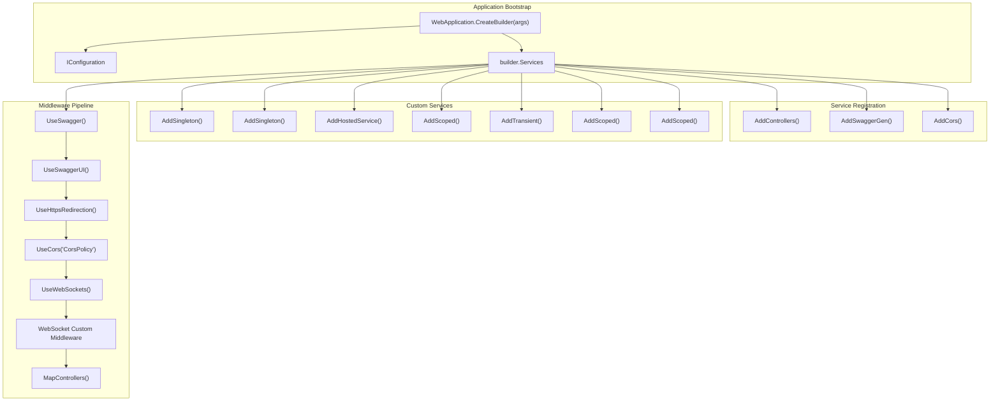
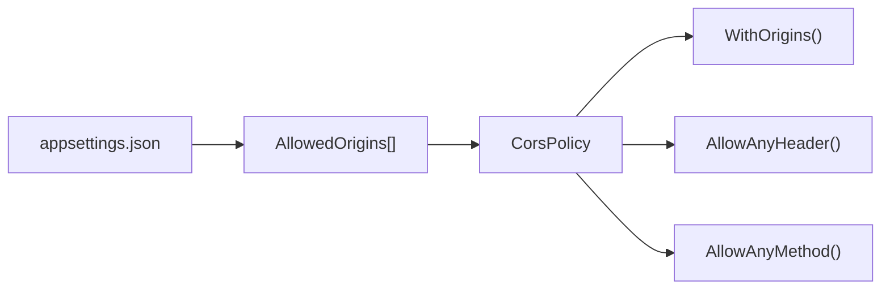
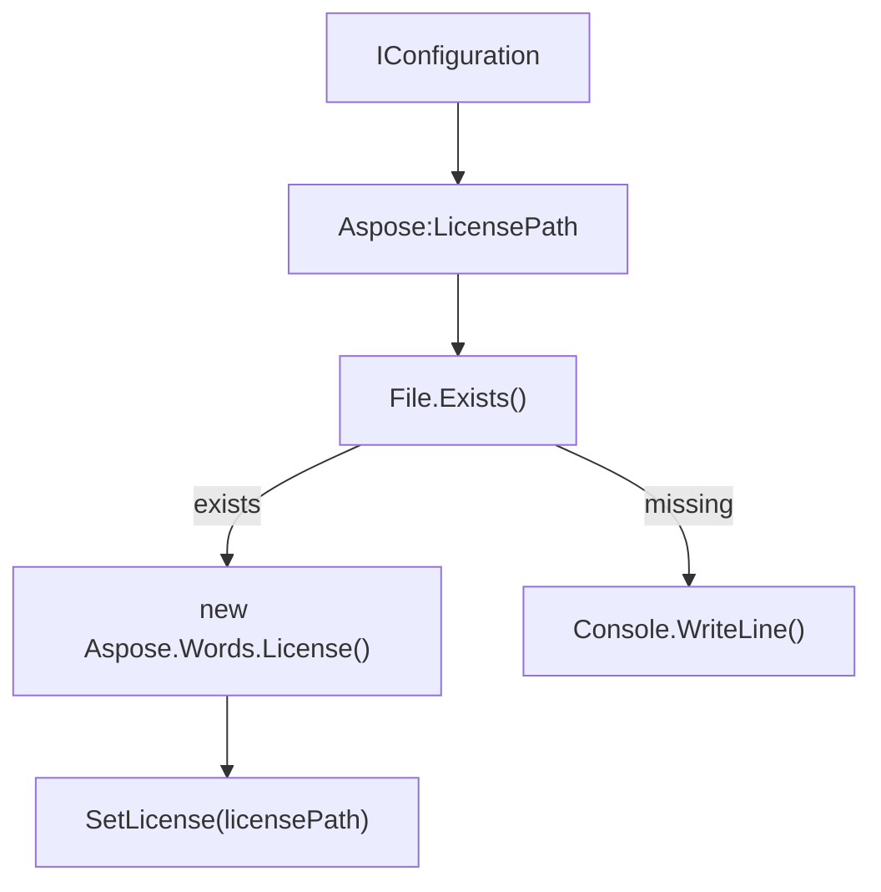
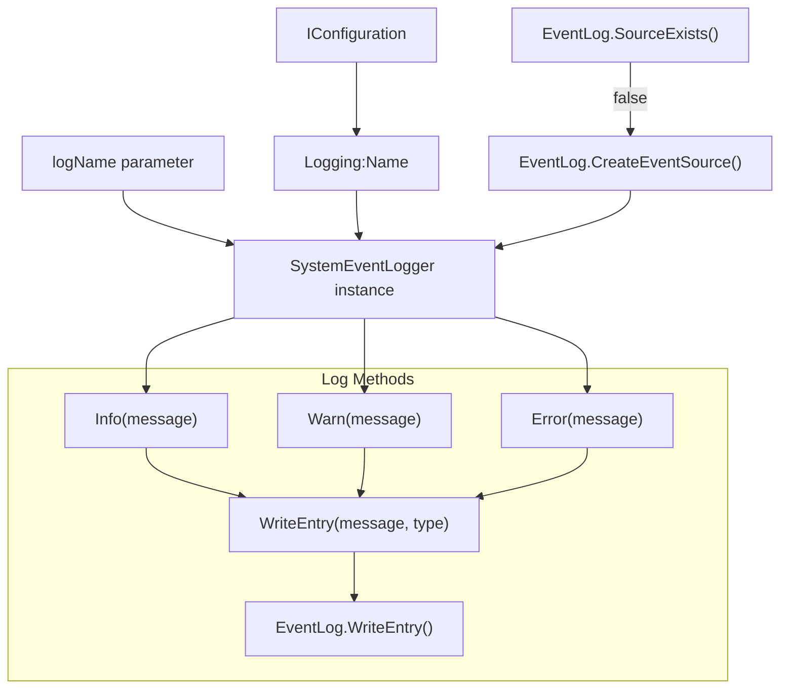
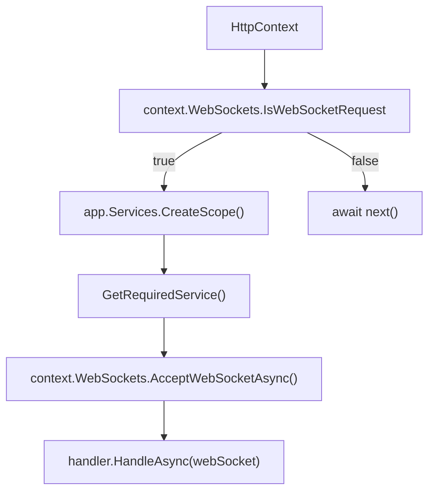
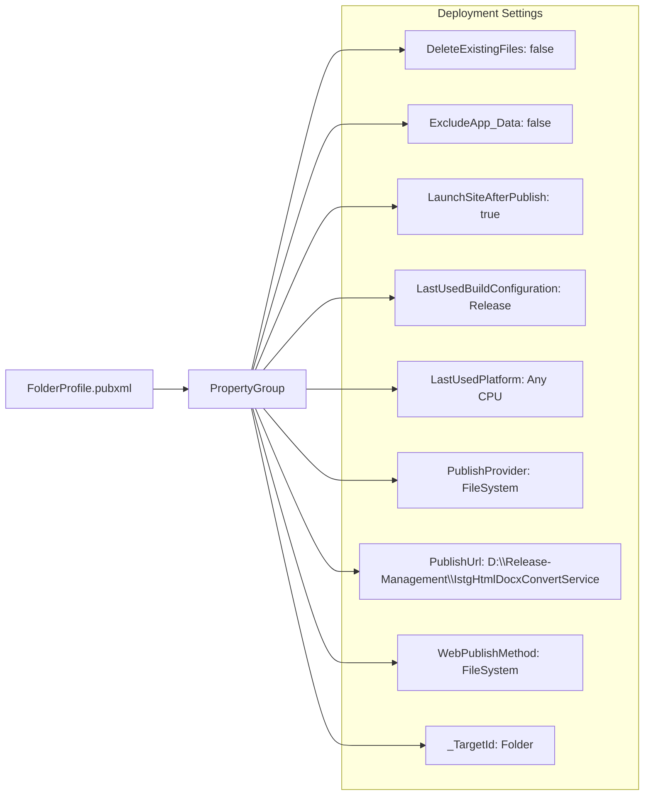

# Configuration and Deployment

Relevant source files

The following files were used as context for generating this wiki page:

- [Logging/SystemEventLogger.cs](Logging/SystemEventLogger.cs)
- [Program.cs](Program.cs)
- [Properties/PublishProfiles/FolderProfile.pubxml](Properties/PublishProfiles/FolderProfile.pubxml)

This document covers the configuration, setup, and deployment procedures for the IstgHtmlDocxConvertService. It explains application startup configuration, dependency injection setup, logging system integration, and deployment processes. For information about the overall system architecture, see [System Architecture](#2). For development environment setup, see [Development Setup](#8).

## Application Configuration Overview

The service uses ASP.NET Core's standard configuration system with dependency injection for service management. The main application bootstrap occurs in `Program.cs`, which configures services, middleware pipeline, and external dependencies.

### Service Registration and Dependency Injection

**Sources:** [Program.cs:5-25](), [Program.cs:42-74]()

### Service Lifecycle Configuration

The application registers services with different lifecycles based on their usage patterns:

| Service | Lifecycle | Purpose |
|---------|-----------|---------|
| `SystemEventLogger` | Singleton | Windows Event Log integration, shared across application |
| `SessionStorageService` | Singleton | Thread-safe session storage using `ConcurrentDictionary` |
| `SessionCleanupService` | Hosted Service | Background service for automatic session cleanup |
| `ConversionService` | Scoped | Document conversion operations, per-request lifecycle |
| `HtmlService` | Transient | HTML processing utilities, lightweight stateless operations |
| `WebSocketHandler` | Scoped | WebSocket connection management, per-connection lifecycle |
| `TokenValidationService` | Scoped | Authentication validation, per-request lifecycle |

**Sources:** [Program.cs:19-25]()

## Configuration Settings Structure

### CORS Configuration

The application reads allowed origins from configuration and sets up CORS policy:

**Sources:** [Program.cs:27-40]()

### Aspose License Configuration

The service requires Aspose.Words licensing configuration:

**Sources:** [Program.cs:76-88]()

## Logging System Configuration

### SystemEventLogger Setup

The `SystemEventLogger` integrates with Windows Event Log system:

**Sources:** [Logging/SystemEventLogger.cs:10-40]()

### Event Log Entry Types

The logger supports three standard Windows Event Log entry types:

| Method | Event Type | Usage |
|--------|------------|-------|
| `Info(string message)` | `EventLogEntryType.Information` | General information messages |
| `Warn(string message)` | `EventLogEntryType.Warning` | Warning conditions |
| `Error(string message)` | `EventLogEntryType.Error` | Error conditions and exceptions |

**Sources:** [Logging/SystemEventLogger.cs:26-39]()

## WebSocket Middleware Configuration

The application implements custom WebSocket middleware for real-time communication:

**Sources:** [Program.cs:55-69]()

## Deployment Configuration

### Publish Profile Settings

The application includes a folder-based publish profile for deployment:

**Sources:** [Properties/PublishProfiles/FolderProfile.pubxml:6-16]()

### Deployment Settings Explained

| Setting | Value | Purpose |
|---------|-------|---------|
| `DeleteExistingFiles` | `false` | Preserves existing files during deployment |
| `ExcludeApp_Data` | `false` | Includes App_Data folder in deployment |
| `LaunchSiteAfterPublish` | `true` | Automatically launches site after publishing |
| `LastUsedBuildConfiguration` | `Release` | Uses Release build configuration |
| `PublishProvider` | `FileSystem` | Publishes to file system (not cloud) |
| `PublishUrl` | `D:\Release-Management\IstgHtmlDocxConvertService` | Target deployment directory |
| `WebPublishMethod` | `FileSystem` | File system-based publishing method |

**Sources:** [Properties/PublishProfiles/FolderProfile.pubxml:7-15]()