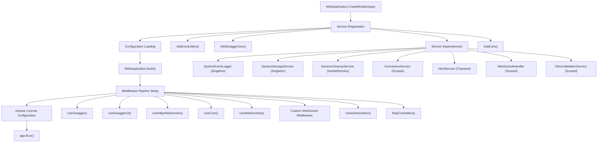
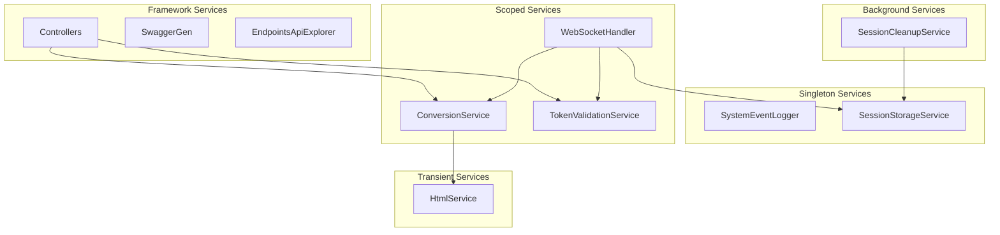
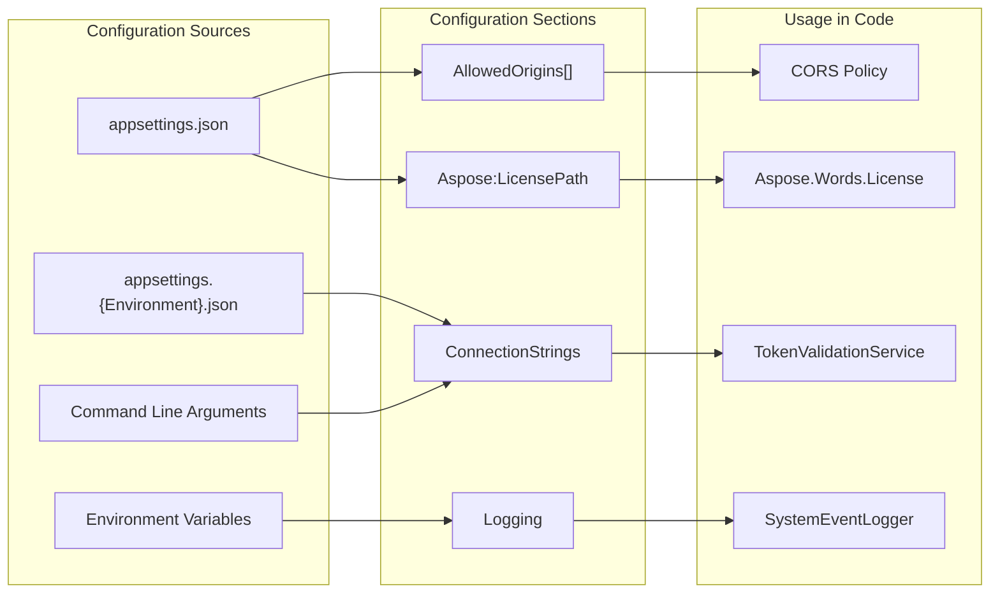
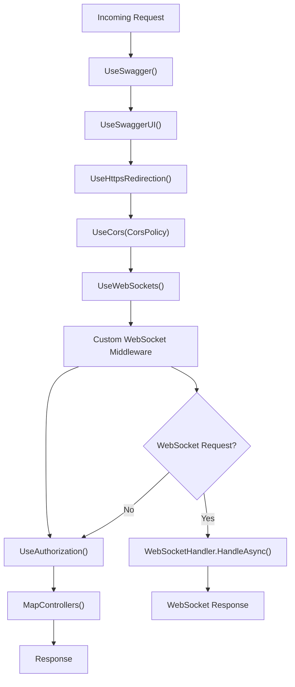
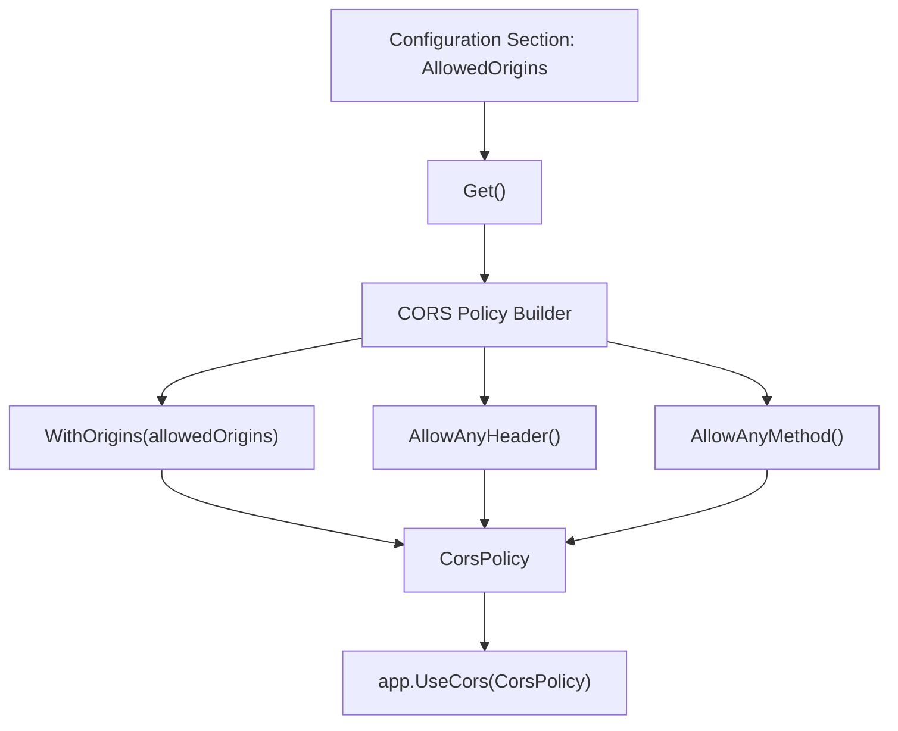
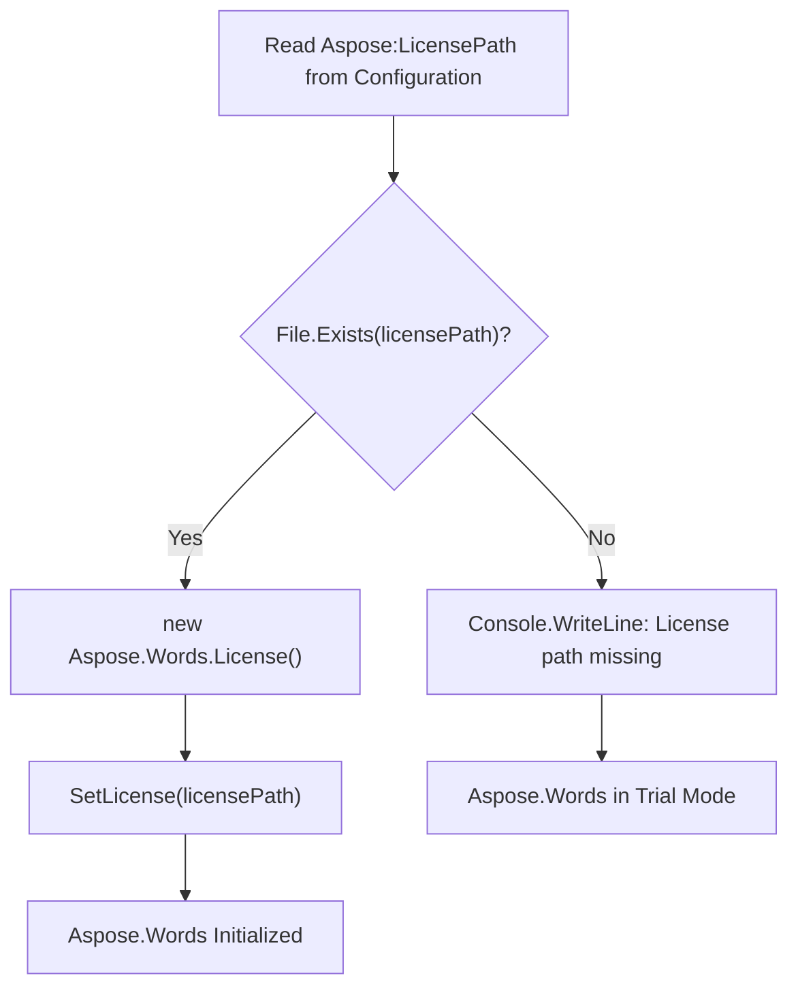

# Application Configuration

Relevant source files

The following files were used as context for generating this wiki page:

- [IstgHtmlDocxConvertService.csproj](IstgHtmlDocxConvertService.csproj)
- [Program.cs](Program.cs)
- [Properties/launchSettings.json](Properties/launchSettings.json)

This page covers the application startup process, dependency injection configuration, and configuration settings for the IstgHtmlDocxConvertService. It focuses on how the application initializes services, configures middleware, and loads configuration values during startup.

For information about logging configuration, see [Logging System](#7.2). For deployment and publishing configuration, see [Deployment and Publishing](#7.3).

## Application Startup Process

The application follows the standard ASP.NET Core startup pattern using the `WebApplication.CreateBuilder` approach. The startup process is defined in the main entry point and handles service registration, configuration loading, and middleware pipeline setup.

### Startup Flow

Sources: [Program.cs:5-90]()

## Dependency Injection Container

The application uses the built-in ASP.NET Core dependency injection container to register services with appropriate lifetimes based on their usage patterns and thread safety requirements.

### Service Registration Configuration

| Service | Lifetime | Purpose |
|---------|----------|---------|
| `SystemEventLogger` | Singleton | Windows Event Log integration |
| `SessionStorageService` | Singleton | Thread-safe session storage |
| `SessionCleanupService` | HostedService | Background session cleanup |
| `ConversionService` | Scoped | Document conversion operations |
| `HtmlService` | Transient | HTML processing utilities |
| `WebSocketHandler` | Scoped | WebSocket connection management |
| `TokenValidationService` | Scoped | Authentication token validation |

### Service Dependencies Diagram

Sources: [Program.cs:19-25](), [Program.cs:11-17]()

## Configuration Sources

The application loads configuration from multiple sources following the standard ASP.NET Core configuration hierarchy. Configuration values are accessed through the `IConfiguration` interface.

### Configuration Structure

### Key Configuration Sections

| Section | Type | Usage |
|---------|------|-------|
| `AllowedOrigins` | `string[]` | CORS policy configuration |
| `Aspose:LicensePath` | `string` | Aspose.Words license file path |
| `ConnectionStrings` | `object` | Database connection configuration |
| `Logging` | `object` | Logging level and provider settings |

Sources: [Program.cs:28](), [Program.cs:77]()

## Middleware Pipeline Configuration

The middleware pipeline is configured in a specific order to ensure proper request processing flow. Each middleware component serves a distinct purpose in the request/response cycle.

### Middleware Pipeline Order

### WebSocket Middleware Implementation

The custom WebSocket middleware handles WebSocket connection requests by creating a scoped service provider and delegating to the `WebSocketHandler` service.

Sources: [Program.cs:46-74](), [Program.cs:55-69]()

## CORS Configuration

Cross-Origin Resource Sharing (CORS) is configured to allow specific origins to access the API endpoints. The allowed origins are loaded from configuration to support different environments.

### CORS Policy Setup

The CORS policy is named `"CorsPolicy"` and allows:
- Origins specified in the `AllowedOrigins` configuration array
- Any HTTP headers
- Any HTTP methods

Sources: [Program.cs:28](), [Program.cs:31-40](), [Program.cs:51]()

## Aspose License Configuration

The Aspose.Words library requires a valid license file for production use. The license path is configured through the application settings and loaded during startup.

### License Loading Process

The license configuration:
- Reads the `Aspose:LicensePath` setting from configuration
- Validates the file exists before attempting to load
- Initializes the Aspose.Words license if the file is found
- Logs an error message if the license file is missing

Sources: [Program.cs:77-88]()

## Development Environment Configuration

The application supports multiple launch profiles for different development scenarios, configured through the launch settings.

### Launch Profiles

| Profile | Command | URL | Purpose |
|---------|---------|-----|---------|
| `HtmlDocxConvertService` | Project | https://localhost:7125 | Direct project execution |
| `IIS Express` | IISExpress | http://localhost:39065 | IIS Express hosting |

Both profiles:
- Set `ASPNETCORE_ENVIRONMENT` to `"Development"`
- Launch the browser to the Swagger UI
- Enable .NET run messages for debugging

Sources: [Properties/launchSettings.json:12-29]()