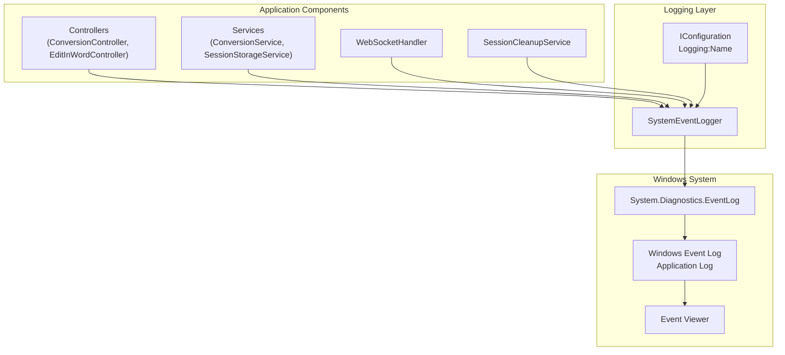
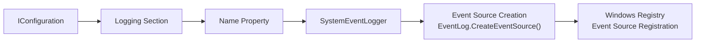
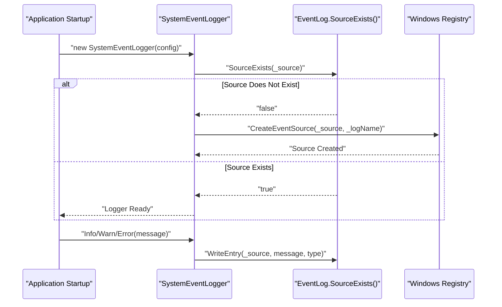
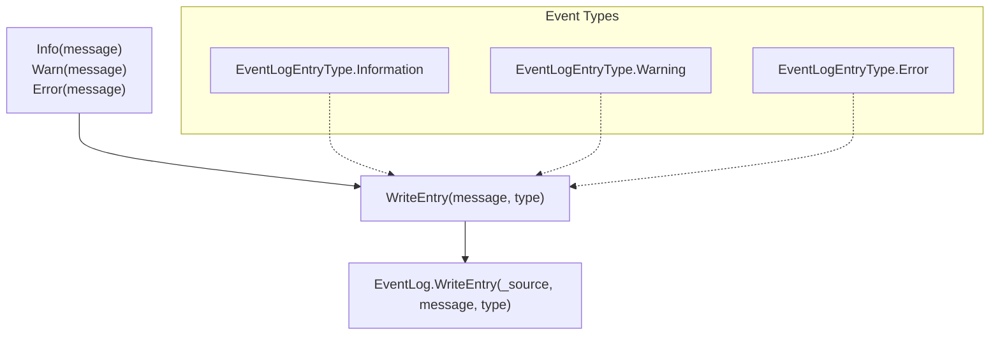

# Logging System

Relevant source files

The following files were used as context for generating this wiki page:

- [Logging/SystemEventLogger.cs](Logging/SystemEventLogger.cs)

This document covers the Windows Event Log integration system used by the IstgHtmlDocxConvertService for centralized system event logging and monitoring. The logging system provides structured event recording for application diagnostics, error tracking, and operational monitoring.

For error handling and error codes, see [HTTP Error Codes](#6.1) and [WebSocket Error Codes](#6.2). For application configuration settings, see [Application Configuration](#7.1).

## System Overview

The logging system is built around the `SystemEventLogger` class, which provides a simplified interface to the Windows Event Log. This enables enterprise-grade logging with built-in Windows system integration for monitoring and alerting.

### Logging Architecture

Sources: [Logging/SystemEventLogger.cs:1-41]()

## SystemEventLogger Implementation

The `SystemEventLogger` class provides three logging levels with automatic event source management:

| Method | Event Type | Windows Event Level | Purpose |
|--------|------------|-------------------|---------|
| `Info()` | EventLogEntryType.Information | Information | Operational messages, successful operations |
| `Warn()` | EventLogEntryType.Warning | Warning | Non-critical issues, deprecated usage |
| `Error()` | EventLogEntryType.Error | Error | Critical errors, exceptions, failures |

### Configuration Integration

The logger reads its event source name from the application configuration:

The configuration path is `Logging:Name` and is accessed via [Logging/SystemEventLogger.cs:12](). If the event source doesn't exist, it's automatically created using [Logging/SystemEventLogger.cs:15-18]().

Sources: [Logging/SystemEventLogger.cs:10-19]()

## Event Source Management

The logger includes automatic event source lifecycle management:

### Event Source Registration Process

The default log name is "Application" [Logging/SystemEventLogger.cs:10](), but can be customized during construction. Event source creation requires administrative privileges on first run.

Sources: [Logging/SystemEventLogger.cs:15-18]()

## Usage Patterns

### Log Level Implementation

Each logging method follows the same internal pattern via the private `WriteEntry` method:

The implementation ensures consistent formatting and source attribution across all log levels through the centralized `WriteEntry` method [Logging/SystemEventLogger.cs:21-24]().

Sources: [Logging/SystemEventLogger.cs:21-39]()

## Integration with Application Components

The logging system integrates with the broader application architecture to provide comprehensive event tracking:

| Component Type | Typical Log Events | Log Level |
|---------------|-------------------|-----------|
| Controllers | API request validation failures | Error |
| ConversionService | Document processing errors | Error |
| ConversionService | Successful conversions | Info |
| SessionStorageService | Session creation/cleanup | Info |
| WebSocketHandler | Connection errors | Error |
| WebSocketHandler | Message processing failures | Warn |
| Authentication | Token validation failures | Error |

The logger is typically injected as a dependency and used throughout the application for consistent event recording to the Windows Event Log system.

Sources: [Logging/SystemEventLogger.cs:1-41]()