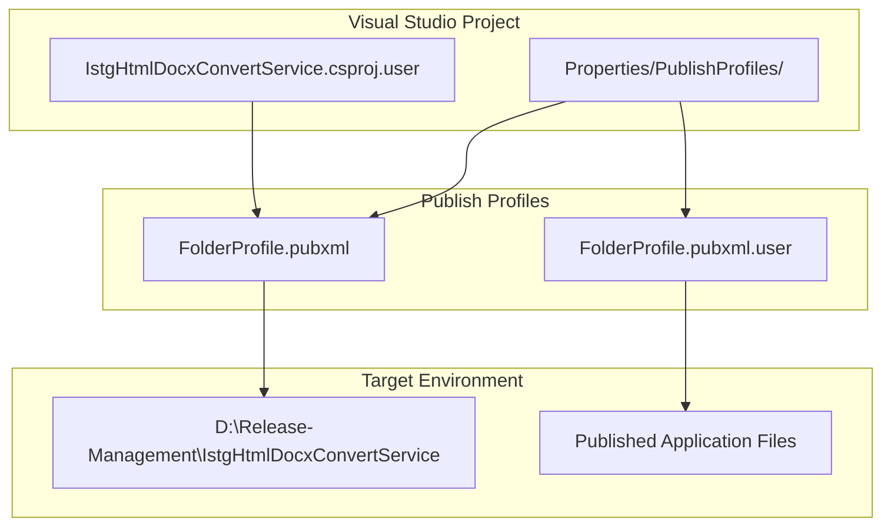
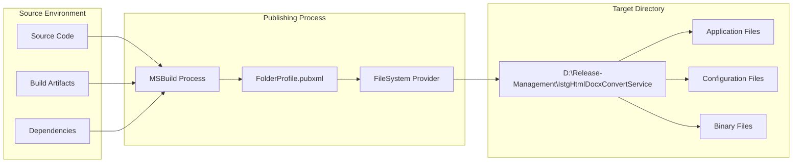
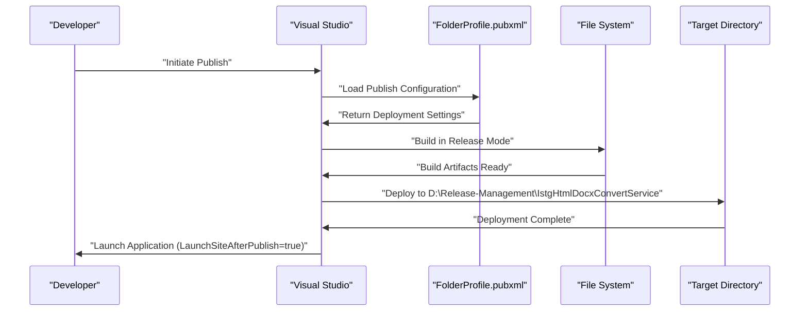

# Deployment and Publishing

Relevant source files

The following files were used as context for generating this wiki page:

- [IstgHtmlDocxConvertService.csproj.user](IstgHtmlDocxConvertService.csproj.user)
- [Properties/PublishProfiles/FolderProfile.pubxml](Properties/PublishProfiles/FolderProfile.pubxml)
- [Properties/PublishProfiles/FolderProfile.pubxml.user](Properties/PublishProfiles/FolderProfile.pubxml.user)

This document covers the deployment and publishing configuration for the IstgHtmlDocxConvertService. It details the Visual Studio publish profiles, file system deployment settings, and build configurations used to deploy the service to production environments.

For information about application configuration and startup, see [Application Configuration](#7.1). For logging system setup during deployment, see [Logging System](#7.2).

## Publishing Configuration Overview

The service uses Visual Studio publish profiles to manage deployment configurations. The primary deployment method is file system publishing to a designated release management directory.

### Publish Profile Structure

**Sources:** [IstgHtmlDocxConvertService.csproj.user:1-6](), [Properties/PublishProfiles/FolderProfile.pubxml:1-17](), [Properties/PublishProfiles/FolderProfile.pubxml.user:1-11]()

## File System Deployment Configuration

The `FolderProfile.pubxml` defines the primary deployment configuration for file system publishing:

| Configuration Property | Value | Purpose |
|------------------------|-------|---------|
| `PublishProvider` | FileSystem | Specifies file system deployment method |
| `PublishUrl` | D:\Release-Management\IstgHtmlDocxConvertService | Target deployment directory |
| `WebPublishMethod` | FileSystem | Publishing method for web applications |
| `LastUsedBuildConfiguration` | Release | Build configuration for deployment |
| `LastUsedPlatform` | Any CPU | Target platform architecture |
| `DeleteExistingFiles` | false | Preserves existing files during deployment |
| `ExcludeApp_Data` | false | Includes App_Data folder in deployment |
| `LaunchSiteAfterPublish` | true | Automatically launches application after publishing |

**Sources:** [Properties/PublishProfiles/FolderProfile.pubxml:6-16]()

### Deployment Target Configuration

**Sources:** [Properties/PublishProfiles/FolderProfile.pubxml:12-14]()

## Build Configuration

The deployment process uses the Release build configuration optimized for production environments:

### Build Settings

- **Configuration**: Release mode for optimized performance
- **Platform**: Any CPU for cross-platform compatibility  
- **Target Framework**: .NET Core/5+ web application
- **Output**: Self-contained deployment to target directory

### Publishing Workflow

**Sources:** [Properties/PublishProfiles/FolderProfile.pubxml:9-11](), [IstgHtmlDocxConvertService.csproj.user:4]()

## Deployment History and Monitoring

The `FolderProfile.pubxml.user` file maintains a comprehensive deployment history with timestamps and success/failure status:

### Recent Deployment Activity

The deployment history shows frequent publishing activity with timestamps indicating active development and deployment cycles. Each entry in the history contains:

- **Timestamp**: Deployment execution time
- **Status**: Success (True) or Failure (False) indicator
- **Target URL**: Confirmation of deployment destination

### Deployment Frequency Analysis

Based on the deployment history, the service shows:
- Multiple daily deployments during active development periods
- Successful deployment rate with occasional failures requiring retry
- Consistent target directory usage for reliable deployment paths

**Sources:** [Properties/PublishProfiles/FolderProfile.pubxml.user:8]()

## Deployment Prerequisites

Before deploying the IstgHtmlDocxConvertService, ensure:

1. **Target Directory**: `D:\Release-Management\IstgHtmlDocxConvertService` exists and has write permissions
2. **Build Configuration**: Release mode is selected for optimized performance
3. **Dependencies**: All required .NET runtime components are available on target system
4. **Service Dependencies**: Database connectivity and Windows Event Log access configured
5. **File System Permissions**: Appropriate permissions for temporary file creation and session storage

## Post-Deployment Verification

After successful deployment:

1. **Application Launch**: Service automatically launches if `LaunchSiteAfterPublish` is enabled
2. **Configuration Validation**: Verify connection strings and authentication settings
3. **Service Registration**: Ensure Windows service registration if applicable
4. **Log Verification**: Check Windows Event Log for startup messages
5. **Endpoint Testing**: Validate HTTP and WebSocket endpoints are responding

**Sources:** [Properties/PublishProfiles/FolderProfile.pubxml:9]()