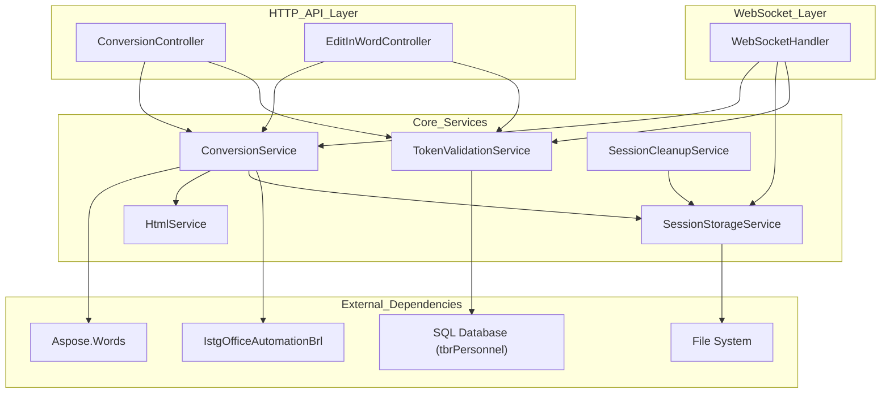
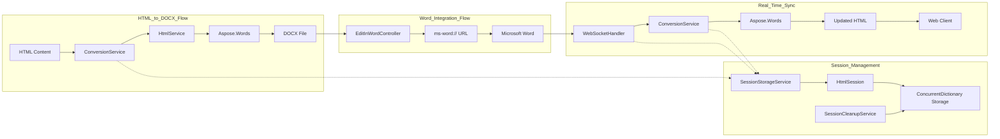

# Overview

Relevant source files

The following files were used as context for generating this wiki page:

- [IstgHtmlDocxConvertService.csproj](IstgHtmlDocxConvertService.csproj)
- [LICENSE](LICENSE)
- [README.md](README.md)

## Purpose and Scope

IstgHtmlDocxConvertService is a .NET 6.0 web service that provides bidirectional document conversion between HTML and Microsoft Word DOCX formats, with real-time collaborative editing capabilities. The service enables users to convert HTML content (particularly from TinyMCE editor) to Word documents, edit those documents in Microsoft Word, and synchronize changes back to HTML in real-time.

This overview covers the high-level architecture, core capabilities, and key components of the system. For detailed API documentation, see [HTTP API Reference](#3). For real-time communication protocols, see [Real-time Communication](#5). For deployment and configuration details, see [Configuration and Deployment](#7).

Sources: [README.md:1-3](), [IstgHtmlDocxConvertService.csproj:1-41]()

## System Architecture

The service follows a layered architecture with multiple communication protocols and external integrations:

### High-Level Component Architecture

Sources: [IstgHtmlDocxConvertService.csproj:25-26](), [IstgHtmlDocxConvertService.csproj:29-31]()

### Document Processing Workflow

Sources: Based on system architecture diagrams and component relationships

## Core Capabilities

### Document Conversion
- **HTML to DOCX**: Converts HTML content to Microsoft Word documents using `ConversionService` and `Aspose.Words`
- **DOCX to HTML**: Processes uploaded Word documents back to HTML format
- **Format Preservation**: Maintains styling, formatting, and document structure across conversions

### Real-Time Collaboration  
- **WebSocket Communication**: Bidirectional real-time updates via `WebSocketHandler`
- **Session Management**: User sessions tracked through `SessionStorageService` with `HtmlSession` objects
- **Live Synchronization**: Changes in Microsoft Word automatically sync to web clients

### Microsoft Word Integration
- **Launch URLs**: Generates `ms-word://` protocol URLs via `EditInWordController` 
- **OOXML Processing**: Handles Word document updates through OOXML format
- **Background Cleanup**: Automatic file and session cleanup via `SessionCleanupService`

Sources: Based on component analysis and workflow diagrams

## Technology Stack

| Component | Technology | Purpose |
|-----------|------------|---------|
| **Framework** | .NET 6.0 | Web service platform |
| **Document Engine** | Aspose.Words | Core document conversion |
| **Database** | SQL Server | User authentication via `tbrPersonnel` |
| **Real-time** | WebSockets | Live collaboration |
| **Graphics** | SkiaSharp | Image processing support |
| **API Documentation** | Swashbuckle | OpenAPI/Swagger integration |
| **External Integration** | IstgOfficeAutomationBrl | Office automation components |

Sources: [IstgHtmlDocxConvertService.csproj:10-14](), [IstgHtmlDocxConvertService.csproj:16-22](), [IstgHtmlDocxConvertService.csproj:24-32]()

## Key Components Overview

### Controllers
- **`ConversionController`**: HTTP REST endpoints for document conversion operations
- **`EditInWordController`**: Word integration endpoints for launching and managing Word editing sessions

### Services  
- **`ConversionService`**: Core business logic for document processing and format conversion
- **`HtmlService`**: Specialized HTML content processing and manipulation
- **`SessionStorageService`**: Session lifecycle management using `ConcurrentDictionary`
- **`TokenValidationService`**: User authentication against SQL database
- **`SessionCleanupService`**: Background service for resource cleanup

### Communication
- **`WebSocketHandler`**: Real-time message processing and client/Word application coordination
- **`HtmlSession`**: Session state container linking users, HTML content, and WebSocket connections

Sources: Based on architectural analysis and component relationships

## License and Usage

The service is distributed under the MIT License, allowing unrestricted use, modification, and distribution for both commercial and non-commercial purposes.

Sources: [LICENSE:1-22]()