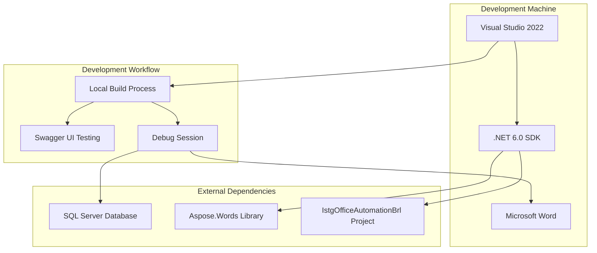
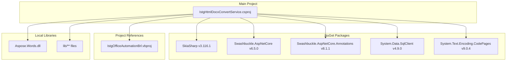
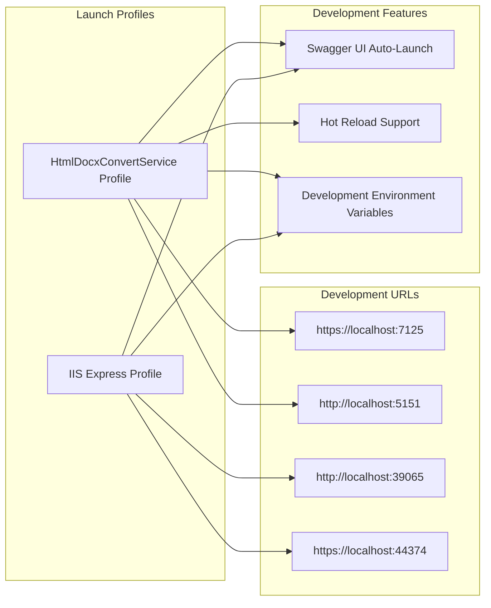
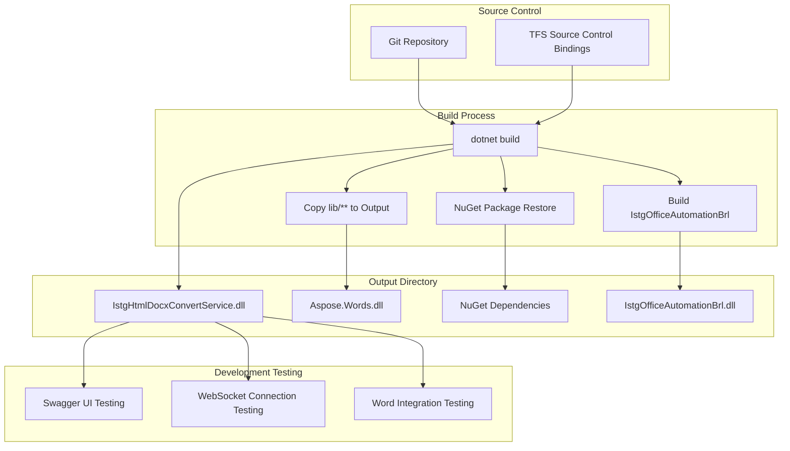

# Development Setup

Relevant source files

The following files were used as context for generating this wiki page:

- [.gitignore](.gitignore)
- [IstgHtmlDocxConvertService.csproj](IstgHtmlDocxConvertService.csproj)
- [Properties/launchSettings.json](Properties/launchSettings.json)

This document provides developers with the information needed to set up the IstgHtmlDocxConvertService development environment, understand the project structure, and configure the build system. It covers project dependencies, development tools, and local development workflow.

For information about deployment and production configuration, see [Deployment and Publishing](#7.3). For application-level configuration settings, see [Application Configuration](#7.1).

## Prerequisites and Requirements

The development environment requires the following components:

| Component | Version | Purpose |
|-----------|---------|---------|
| .NET SDK | 6.0+ | Target framework runtime |
| Visual Studio | 2022+ | IDE with project support |
| Microsoft Word | 2016+ | Testing Word integration features |
| SQL Server | Any version | Database authentication testing |

### Development Environment Setup

The project uses .NET 6.0 as specified in [IstgHtmlDocxConvertService.csproj:11]() with nullable reference types and implicit usings enabled [IstgHtmlDocxConvertService.csproj:12-13]().

**Development Environment Diagram**

Sources: [IstgHtmlDocxConvertService.csproj](), [Properties/launchSettings.json]()

## Project Structure and Dependencies

### Core Project Configuration

The main project file defines the service structure and dependencies. The project targets .NET 6.0 with modern C# features enabled.

**Project Dependencies Diagram**

Sources: [IstgHtmlDocxConvertService.csproj:16-32]()

### Key Dependencies

| Dependency | Version | Purpose |
|------------|---------|---------|
| `SkiaSharp` | 3.116.1 | Graphics rendering for document processing |
| `Swashbuckle.AspNetCore` | 6.5.0 | API documentation and testing interface |
| `System.Data.SqlClient` | 4.9.0 | Database connectivity for authentication |
| `System.Text.Encoding.CodePages` | 9.0.4 | Text encoding support for document conversion |
| `Aspose.Words` | Local DLL | Core document conversion engine |
| `IstgOfficeAutomationBrl` | Project Reference | Office automation business logic |

## Development Environment Configuration

### Launch Profiles

The development environment supports two launch configurations defined in [Properties/launchSettings.json]():

**Launch Configuration Diagram**

Sources: [Properties/launchSettings.json:12-30]()

### Development Server Configuration

The default development profile `HtmlDocxConvertService` runs on:
- HTTPS: `https://localhost:7125`
- HTTP: `http://localhost:5151`
- Auto-launches Swagger UI at `/swagger`
- Sets `ASPNETCORE_ENVIRONMENT=Development`

## Building and Running

### Local Development Build

The project includes specific build configurations for development:

1. **Library Management**: The `lib` folder contains the Aspose.Words DLL and related files that are copied to the output directory [IstgHtmlDocxConvertService.csproj:34-38]().

2. **Source Control Integration**: The project includes Team Foundation Server source control bindings [IstgHtmlDocxConvertService.csproj:3-8]().

3. **Build Exclusions**: Standard .NET build artifacts are excluded via [.gitignore:10-54]().

### Development Workflow

**Development Build Process Diagram**

Sources: [IstgHtmlDocxConvertService.csproj](), [.gitignore](), [Properties/launchSettings.json]()

### Build Commands

| Command | Purpose |
|---------|---------|
| `dotnet restore` | Restore NuGet packages and project references |
| `dotnet build` | Compile the project and dependencies |
| `dotnet run` | Build and start the development server |
| `dotnet run --launch-profile "IIS Express"` | Run using IIS Express profile |

### Development Environment Variables

The development configuration sets:
- `ASPNETCORE_ENVIRONMENT=Development` - Enables development features
- Development-specific logging and error handling
- Swagger UI auto-generation and launch

Sources: [Properties/launchSettings.json:18-19,27-28]()