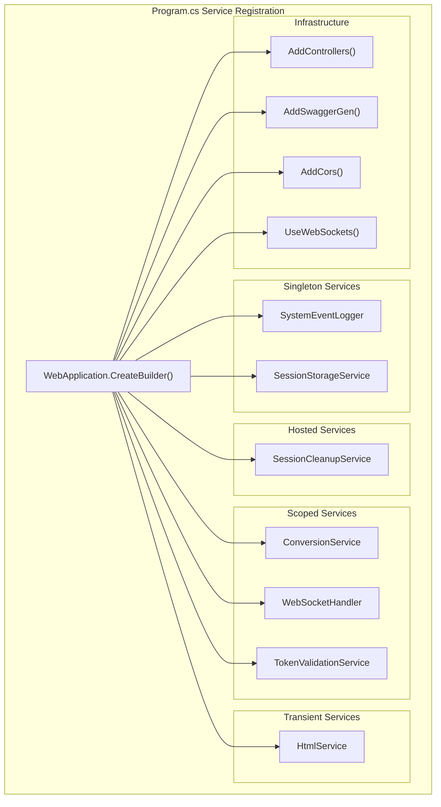
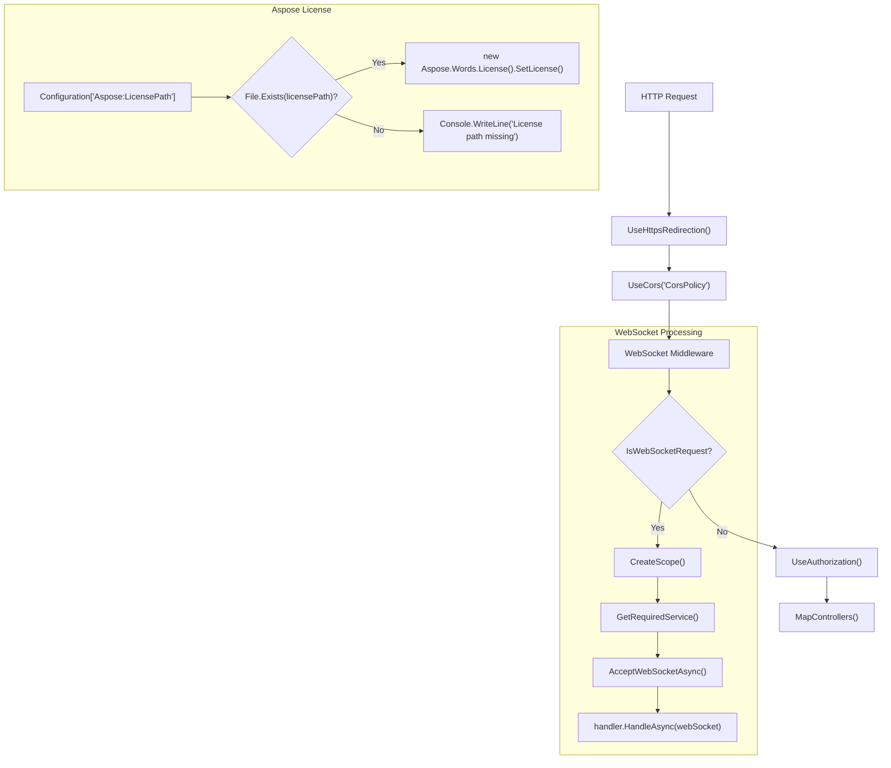
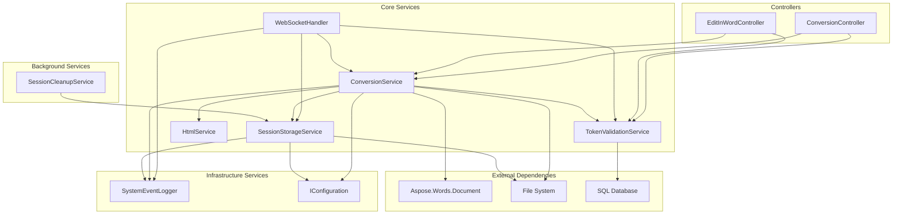
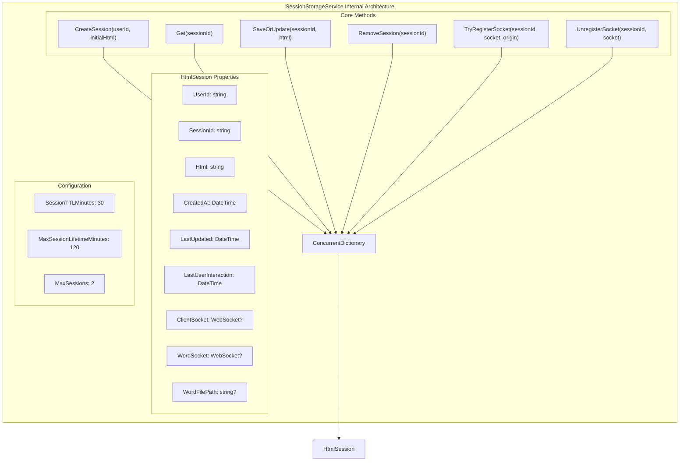
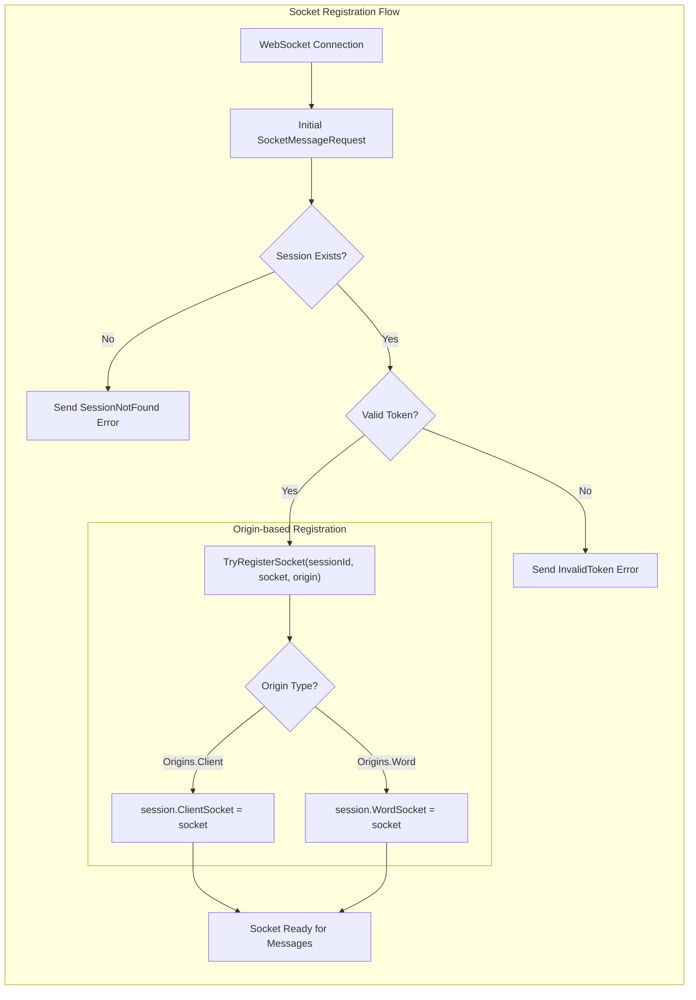
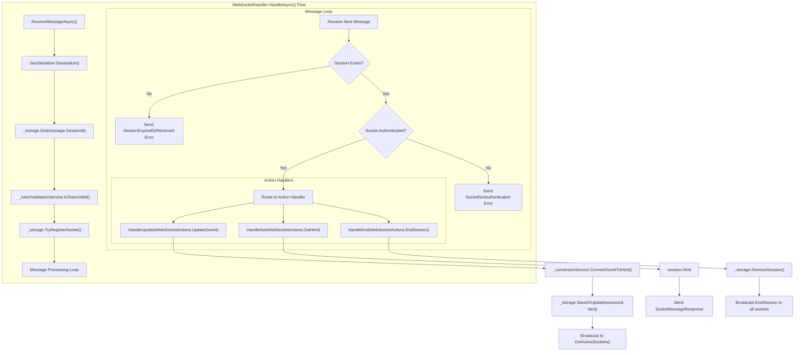
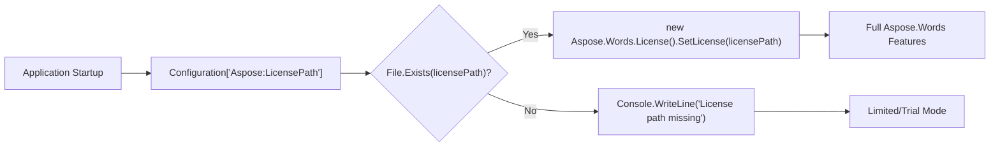
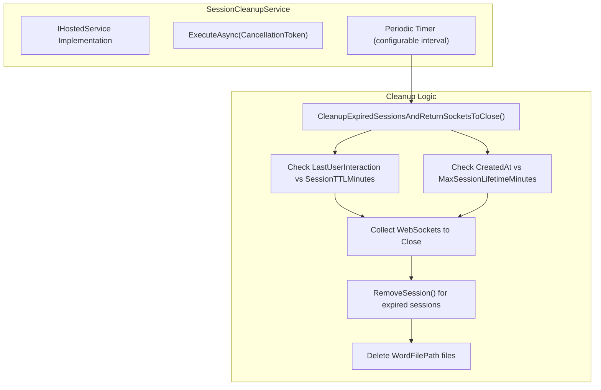

# System Architecture

Relevant source files

The following files were used as context for generating this wiki page:

- [Program.cs](Program.cs)
- [Services/ConversionService.cs](Services/ConversionService.cs)
- [Services/SessionStorageService.cs](Services/SessionStorageService.cs)
- [WebSockets/WebSocketHandler.cs](WebSockets/WebSocketHandler.cs)

This document explains the high-level architecture of the IstgHtmlDocxConvertService, including its layered design, dependency injection configuration, WebSocket communication patterns, and session management infrastructure. The system implements a multi-protocol document conversion service that supports both synchronous HTTP APIs and real-time WebSocket communication for collaborative document editing workflows.

For specific API endpoint documentation, see [HTTP API Reference](#3). For real-time communication details, see [Real-time Communication](#5). For error handling patterns, see [Error Handling](#6).

## Application Startup and Dependency Injection

The application uses ASP.NET Core's built-in dependency injection container with a carefully designed service lifetime strategy. The startup configuration establishes the foundation for the entire system architecture.

### Service Registration Architecture

The service registration follows a specific pattern where stateful services like `SessionStorageService` are registered as singletons to maintain session data across requests, while request-specific services like `ConversionService` are scoped to ensure proper resource management.

Sources: [Program.cs:19-25]()

### Middleware Pipeline Architecture

The middleware pipeline demonstrates the dual-protocol nature of the system, handling both traditional HTTP requests through controllers and WebSocket connections through custom middleware.

Sources: [Program.cs:55-69](), [Program.cs:76-88]()

## Core Service Layer Architecture

The service layer implements a hierarchical dependency structure with clear separation of concerns. Each service has specific responsibilities and dependencies that create a well-defined architecture.

### Service Dependency Graph

Sources: [Services/ConversionService.cs:24-36](), [Services/SessionStorageService.cs:18-26](), [WebSockets/WebSocketHandler.cs:20-26]()

### Service Lifetime and Resource Management

| Service | Lifetime | Purpose | Key Dependencies |
|---------|----------|---------|------------------|
| `SystemEventLogger` | Singleton | Windows Event Log integration | None |
| `SessionStorageService` | Singleton | In-memory session storage using `ConcurrentDictionary` | `IConfiguration`, `SystemEventLogger` |
| `SessionCleanupService` | Hosted | Background cleanup of expired sessions | `SessionStorageService` |
| `ConversionService` | Scoped | Document conversion using Aspose.Words | `HtmlService`, `SessionStorageService`, `TokenValidationService` |
| `WebSocketHandler` | Scoped | WebSocket message processing | `ConversionService`, `SessionStorageService`, `TokenValidationService` |
| `TokenValidationService` | Scoped | Database-based token validation | SQL Database |
| `HtmlService` | Transient | HTML processing utilities | None |

Sources: [Program.cs:19-25]()

## Session Management Architecture

The session management system uses a `ConcurrentDictionary<string, HtmlSession>` as the core storage mechanism, providing thread-safe operations for multiple concurrent WebSocket connections.

### Session Storage Implementation

The session lifecycle management includes automatic cleanup based on both inactivity timeout (`SessionTTLMinutes`) and absolute lifetime limits (`MaxSessionLifetimeMinutes`).

Sources: [Services/SessionStorageService.cs:12-26](), [Services/SessionStorageService.cs:27-45](), [Services/SessionStorageService.cs:181-208]()

### WebSocket Registration and Authentication

Sources: [WebSockets/WebSocketHandler.cs:54-91](), [Services/SessionStorageService.cs:117-146]()

## WebSocket Communication Architecture

The WebSocket communication system implements a message-based protocol with specific action handlers and error management. The system supports bidirectional communication between web clients and Microsoft Word applications.

### WebSocket Message Processing Flow

Sources: [WebSockets/WebSocketHandler.cs:54-152](), [WebSockets/WebSocketHandler.cs:154-192](), [WebSockets/WebSocketHandler.cs:194-218](), [WebSockets/WebSocketHandler.cs:220-241]()

### WebSocket Protocol Message Types

| Message Type | Action | Direction | Purpose |
|--------------|--------|-----------|---------|
| `SocketMessageRequest` | `WebSocketActions.UpdateOoxml` | Word → Server | Send OOXML content for conversion |
| `SocketMessageRequest` | `WebSocketActions.GetHtml` | Client → Server | Request current HTML content |
| `SocketMessageRequest` | `WebSocketActions.EndSession` | Any → Server | Terminate session |
| `SocketMessageResponse` | `WebSocketActions.GetHtml` | Server → Client | Broadcast HTML updates |
| `SocketMessageError` | Various | Server → Client | Error notifications with error codes |

Sources: [WebSockets/WebSocketHandler.cs:27-32]()

## Document Conversion Architecture

The document conversion system leverages Aspose.Words as the core engine with custom HTML processing and session integration. The system supports multiple conversion workflows including synchronous HTTP conversion and asynchronous WebSocket-based conversion.

### Conversion Service Implementation

```mermaid
graph TB
    subgraph "ConversionService Core Methods"
        ConvertHtmlToDocx["ConvertHtmlToDocx(htmlContent)"]
        ConvertDocxToHtml["ConvertDocxToHtml(docxFile)"]
        GenerateWordLaunchLink["GenerateWordLaunchLink(token, htmlContent)"]
        ConvertOoxmlToHtml["ConvertOoxmlToHtml(ooxmlContent)"]
    end
    
    subgraph "Aspose.Words Integration"
        Document["new Document(stream, loadOptions)"]
        LoadOptions["LoadOptions { LoadFormat, Encoding }"]
        SaveOptions["HtmlSaveOptions { ExportImagesAsBase64, PrettyFormat }"]
        SaveFormat["SaveFormat.Docx / SaveFormat.Html"]
    end
    
    subgraph "Session Integration"
        CreateSession["_storage.CreateSession(userId, htmlContent)"]
        EmbedProperties["document.CustomDocumentProperties.Add()"]
        SetWordFilePath["_storage.SetWordFilePath(sessionId, filePath)"]
    end
    
    subgraph "File Management"
        TempFilesFolderPath["_configuration['TempFilesFolderPath']"]
        PublicHostingFolderUrl["_configuration['PublicHostingFolderUrl']"]
        WordLaunchUrl["ms-word:ofe|u|{publicUrl}"]
    end
    
    ConvertHtmlToDocx --> Document
    ConvertHtmlToDocx --> LoadOptions
    ConvertHtmlToDocx --> SaveFormat
    
    ConvertDocxToHtml --> Document
    ConvertDocxToHtml --> SaveOptions
    ConvertDocxToHtml --> HtmlService["_htmlService.ExtractBodyInnerHtml()"]
    
    GenerateWordLaunchLink --> CreateSession
    GenerateWordLaunchLink --> Document
    GenerateWordLaunchLink --> EmbedProperties
    GenerateWordLaunchLink --> SetWordFilePath
    GenerateWordLaunchLink --> WordLaunchUrl
    
    ConvertOoxmlToHtml --> Document
    ConvertOoxmlToHtml --> SaveOptions
    ConvertOoxmlToHtml --> HtmlService
```

Sources: [Services/ConversionService.cs:41-74](), [Services/ConversionService.cs:79-132](), [Services/ConversionService.cs:138-181](), [Services/ConversionService.cs:183-222]()

### Aspose.Words Configuration and Licensing

The system requires proper Aspose.Words licensing configuration during application startup. The license path is configured through `appsettings.json` and validated at startup.

Sources: [Program.cs:76-88]()

## Background Services Architecture

The system includes background services for maintenance tasks, specifically session cleanup to prevent resource leaks and manage expired sessions.

### Session Cleanup Service

Sources: [Services/SessionStorageService.cs:181-208](), [Program.cs:21]()

## External Dependencies and Configuration

The system integrates with several external dependencies that require specific configuration and initialization patterns.

### Configuration Architecture

| Configuration Section | Purpose | Used By |
|----------------------|---------|---------|
| `AllowedOrigins` | CORS policy configuration | Startup pipeline |
| `Aspose:LicensePath` | Aspose.Words license file path | License initialization |
| `TempFilesFolderPath` | Temporary file storage location | ConversionService |
| `PublicHostingFolderUrl` | Public URL for Word launch links | ConversionService |
| `SessionTTLMinutes` | Session inactivity timeout | SessionStorageService |
| `MaxSessionLifetimeMinutes` | Maximum session duration | SessionStorageService |
| `MaxSessions` | Per-user session limit | SessionStorageService |

Sources: [Program.cs:28](), [Program.cs:77](), [Services/ConversionService.cs:31-32](), [Services/SessionStorageService.cs:22-24]()