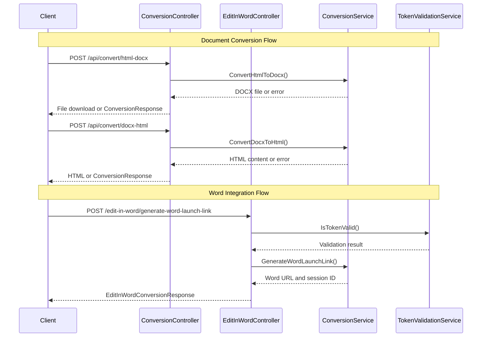

# HTTP API Reference

<details>
<summary>Relevant source files</summary>

The following files were used as context for generating this wiki page:

- [Controllers/ConversionController.cs](Controllers/ConversionController.cs)
- [Controllers/EditInWordController.cs](Controllers/EditInWordController.cs)

</details>


This document provides comprehensive reference documentation for the HTTP REST API endpoints exposed by the IstgHtmlDocxConvertService. The service provides two main API categories: document conversion between HTML and DOCX formats, and Word integration for editing HTML content in Microsoft Word.

For real-time communication features and WebSocket protocols, see [Real-time Communication](#5). For detailed service implementation details, see [Core Services](#4).

## API Architecture Overview

The HTTP API consists of two primary controllers that handle different aspects of document processing and Word integration.

### API Controller Structure

```mermaid
graph TB
    subgraph "HTTP API Endpoints"
        ConversionAPI[ConversionController<br/>"/api/convert"]
        EditInWordAPI[EditInWordController<br/>"/edit-in-word"]
    end
    
    subgraph "ConversionController Endpoints"
        HtmlToDocx["POST /api/convert/html-docx<br/>Convert HTML to DOCX"]
        DocxToHtml["POST /api/convert/docx-html<br/>Convert DOCX to HTML"]
    end
    
    subgraph "EditInWordController Endpoints"
        GenerateLink["POST /edit-in-word/generate-word-launch-link<br/>Generate Word Launch Link"]
    end
    
    subgraph "Core Services"
        ConversionService["ConversionService<br/>Document Processing Logic"]
        TokenValidationService["TokenValidationService<br/>Authentication"]
        SessionStorageService["SessionStorageService<br/>Session Management"]
    end
    
    ConversionAPI --> HtmlToDocx
    ConversionAPI --> DocxToHtml
    EditInWordAPI --> GenerateLink
    
    HtmlToDocx --> ConversionService
    DocxToHtml --> ConversionService
    GenerateLink --> ConversionService
    GenerateLink --> TokenValidationService
    GenerateLink --> SessionStorageService
```

**Sources:** [Controllers/ConversionController.cs:1-80](), [Controllers/EditInWordController.cs:1-56]()

### Request/Response Flow Architecture



**Sources:** [Controllers/ConversionController.cs:30-77](), [Controllers/EditInWordController.cs:31-53]()

## Document Conversion API

The ConversionController provides endpoints for bidirectional conversion between HTML and DOCX formats. All endpoints are located under the `/api/convert` route.

### HTML to DOCX Conversion

Converts HTML content to a downloadable DOCX file.

| Attribute | Value |
|-----------|-------|
| **Endpoint** | `POST /api/convert/html-docx` |
| **Controller** | ConversionController |
| **Method** | HtmlToDocx |
| **Authentication** | None required |

#### Request Format

```json
{
  "html": "string (required)"
}
```

The request must contain valid HTML content in the `html` field. Empty or null HTML content will result in a validation error.

#### Response Formats

**Success Response:** Returns a DOCX file for download with appropriate content headers.

**Error Response:**
```json
{
  "Success": false,
  "Message": "string"
}
```

#### Implementation Details

The endpoint validates that HTML content is not null or empty before processing. The conversion is handled asynchronously by the `ConversionService.ConvertHtmlToDocx()` method.

**Sources:** [Controllers/ConversionController.cs:24-43]()

### DOCX to HTML Conversion

Converts an uploaded DOCX file to HTML content.

| Attribute | Value |
|-----------|-------|
| **Endpoint** | `POST /api/convert/docx-html` |
| **Controller** | ConversionController |
| **Method** | DocxToHtml |
| **Content Type** | `multipart/form-data` |
| **Authentication** | None required |

#### Request Format

The request must be sent as `multipart/form-data` with a file field containing the DOCX document.

**Form Fields:**
- `file`: DOCX file (required)

#### Response Formats

**Success Response:** Returns HTML content as text.

**Error Response:**
```json
{
  "Success": false,
  "Message": "string"
}
```

#### Implementation Details

The endpoint validates that a file is provided and has content before processing. The file is read into a byte array and passed to `ConversionService.ConvertDocxToHtml()` for processing.

**Sources:** [Controllers/ConversionController.cs:50-77]()

## Word Integration API

The EditInWordController provides functionality for editing HTML content in Microsoft Word through generated launch links. All endpoints require authentication via token headers.

### Generate Word Launch Link

Creates a Microsoft Word launch link for editing HTML content, with session management for real-time collaboration.

| Attribute | Value |
|-----------|-------|
| **Endpoint** | `POST /edit-in-word/generate-word-launch-link` |
| **Controller** | EditInWordController |
| **Method** | OpenInWordHtmlDocx |
| **Authentication** | Required (token header) |

#### Request Format

**Headers:**
- `token`: Authentication token (required)

**Body:**
```json
{
  "Html": "string (required)"
}
```

#### Response Formats

**Success Response:**
```json
{
  "Success": true,
  "Message": "Word link generated successfully.",
  "sessionId": "string",
  "WordUrl": "string"
}
```

**Error Responses:**

*Authentication Error:* HTTP 401 Unauthorized

*Validation Error:*
```json
{
  "ErrorCode": "string",
  "Success": false,
  "Message": "string"
}
```

#### Implementation Details

The endpoint performs several validation steps:

1. **Token Validation:** Uses `TokenValidationService.IsTokenValid()` to authenticate the request
2. **HTML Processing:** Converts HTML to DOCX and generates a Word launch URL
3. **Session Management:** Creates or manages session for real-time collaboration
4. **Error Handling:** Returns specific error codes for different failure scenarios

The Word launch URL follows the `ms-word://` protocol scheme to open Microsoft Word directly with the converted document.

**Sources:** [Controllers/EditInWordController.cs:24-53]()

## Authentication and Error Handling

### Authentication Requirements

| Endpoint | Authentication Required |
|----------|------------------------|
| `/api/convert/*` | No |
| `/edit-in-word/*` | Yes (token header) |

### Common Error Codes

The API uses structured error responses with specific error codes defined in the `HttpErrorCodes` system. Common error scenarios include:

- **Authentication failures:** HTTP 401 for invalid tokens
- **Validation errors:** HTTP 400 for missing or invalid request data  
- **Processing errors:** Specific error codes for conversion failures

For detailed error code documentation, see [HTTP Error Codes](#6.1).

### Response Models

The API uses consistent response models for different endpoint types:

- **ConversionResponse:** Used for conversion endpoints
- **EditInWordConversionResponse:** Used for Word integration endpoints
- **EditInWordConversionError:** Used for Word integration error responses

**Sources:** [Controllers/ConversionController.cs:34-38](), [Controllers/EditInWordController.cs:41-52]()