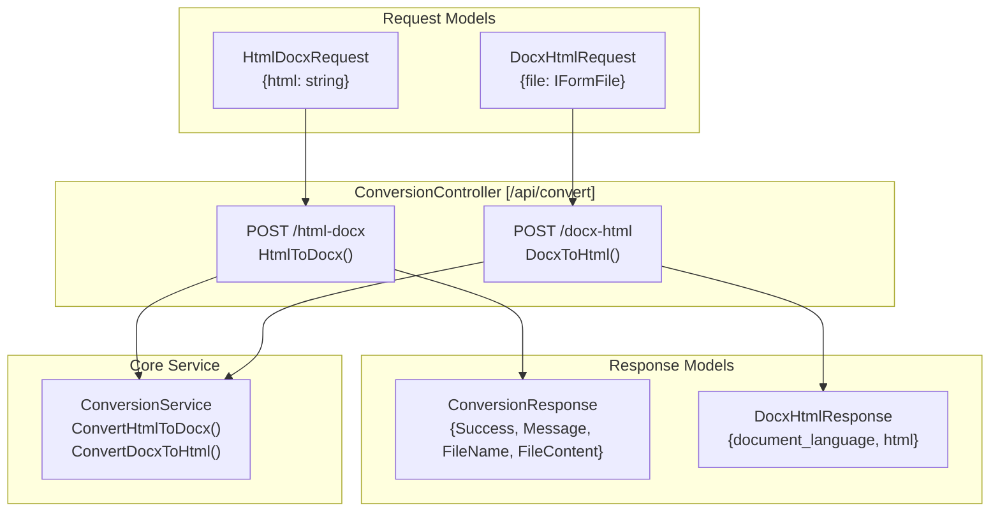
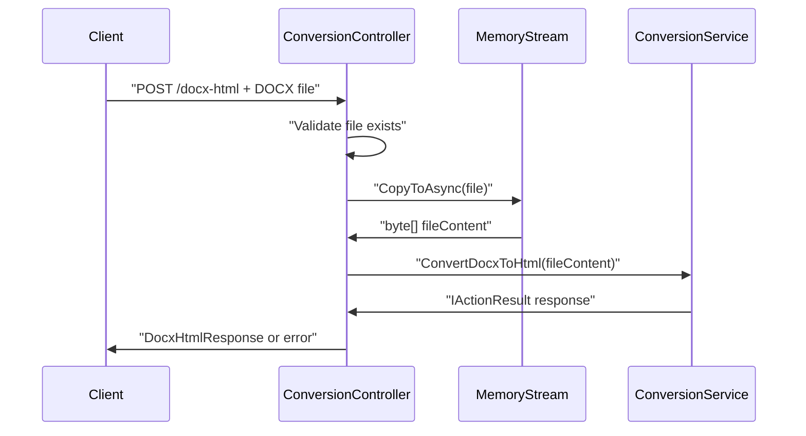
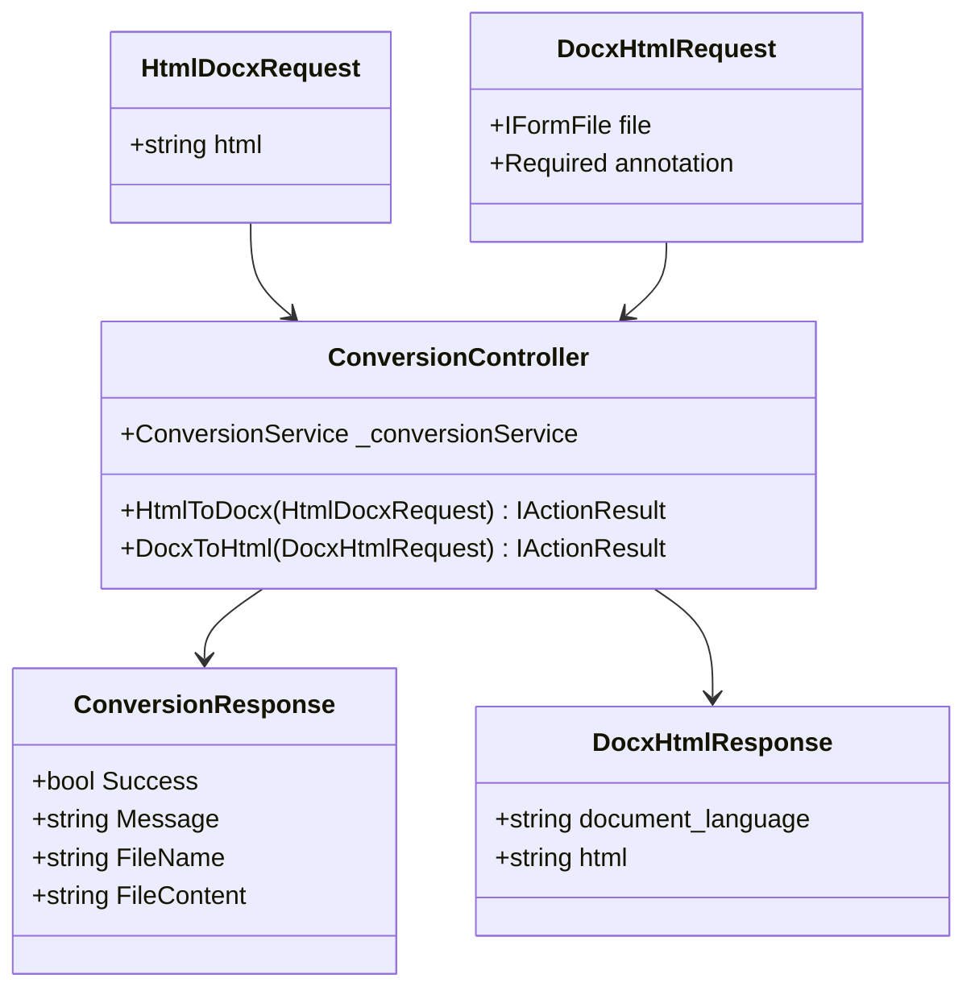

# Document Conversion API

<details>
<summary>Relevant source files</summary>

The following files were used as context for generating this wiki page:

- [Controllers/ConversionController.cs](Controllers/ConversionController.cs)
- [Models/ConversionResponse.cs](Models/ConversionResponse.cs)
- [Models/DocxHtmlRequest.cs](Models/DocxHtmlRequest.cs)
- [Models/DocxHtmlResponse.cs](Models/DocxHtmlResponse.cs)
- [Models/HtmlDocxRequest.cs](Models/HtmlDocxRequest.cs)

</details>


This page documents the REST API endpoints provided by the `ConversionController` for converting documents between HTML and DOCX formats. These endpoints enable bidirectional conversion workflows for document processing.

For Word integration features that allow launching Microsoft Word with converted documents, see [Word Integration API](#3.2). For details about the underlying conversion services and business logic, see [Document Conversion Services](#4.1).

## API Endpoints Overview

The `ConversionController` exposes two primary conversion endpoints under the `/api/convert` route prefix. Both endpoints are POST operations that handle different conversion directions and input formats.

### ConversionController Endpoint Structure



**Sources:** [Controllers/ConversionController.cs:1-80](), [Models/HtmlDocxRequest.cs:1-7](), [Models/DocxHtmlRequest.cs:1-13](), [Models/ConversionResponse.cs:1-10](), [Models/DocxHtmlResponse.cs:1-8]()

## HTML to DOCX Conversion

The `/api/convert/html-docx` endpoint converts HTML content to a DOCX file format.

### Endpoint Details

| Property | Value |
|----------|-------|
| **Route** | `POST /api/convert/html-docx` |
| **Method** | `HtmlToDocx()` |
| **Content Type** | `application/json` |
| **Request Model** | `HtmlDocxRequest` |
| **Response Model** | `ConversionResponse` |

### Request Format

The endpoint accepts a JSON payload containing the HTML content to convert:

```json
{
  "html": "<html><body><h1>Document Title</h1><p>Content...</p></body></html>"
}
```

### Validation Rules

- The `html` field cannot be null or empty [Controllers/ConversionController.cs:32-39]()
- Invalid HTML content returns a `BadRequest` response with error details

### Response Behavior

The endpoint returns an `IActionResult` containing either:
- **Success**: A file download response with the generated DOCX file
- **Error**: A `ConversionResponse` object with error details

**Sources:** [Controllers/ConversionController.cs:19-43](), [Models/HtmlDocxRequest.cs:1-7](), [Models/ConversionResponse.cs:1-10]()

## DOCX to HTML Conversion

The `/api/convert/docx-html` endpoint converts uploaded DOCX files to HTML format.

### Endpoint Details

| Property | Value |
|----------|-------|
| **Route** | `POST /api/convert/docx-html` |
| **Method** | `DocxToHtml()` |
| **Content Type** | `multipart/form-data` |
| **Request Model** | `DocxHtmlRequest` |
| **Response Model** | `DocxHtmlResponse` |

### File Upload Process



### Validation Rules

- The `file` field is required and cannot be null [Models/DocxHtmlRequest.cs:11-12]()
- File length must be greater than 0 [Controllers/ConversionController.cs:59-66]()
- Invalid file uploads return a `BadRequest` response with error details

### File Processing

The endpoint processes the uploaded file by:
1. Reading the file content into a `MemoryStream` [Controllers/ConversionController.cs:69-72]()
2. Converting the stream to a byte array
3. Passing the byte array to `ConversionService.ConvertDocxToHtml()` [Controllers/ConversionController.cs:75]()

**Sources:** [Controllers/ConversionController.cs:45-77](), [Models/DocxHtmlRequest.cs:1-13](), [Models/DocxHtmlResponse.cs:1-8]()

## Request and Response Models

The API uses strongly-typed models for request validation and response formatting.

### Model Relationships



### Model Specifications

| Model | Purpose | Key Fields |
|-------|---------|------------|
| `HtmlDocxRequest` | HTML to DOCX input | `html` (string) |
| `DocxHtmlRequest` | DOCX file upload | `file` (IFormFile, Required) |
| `ConversionResponse` | General API response | `Success`, `Message`, `FileName`, `FileContent` |
| `DocxHtmlResponse` | DOCX to HTML output | `document_language`, `html` |

**Sources:** [Models/HtmlDocxRequest.cs:1-7](), [Models/DocxHtmlRequest.cs:1-13](), [Models/ConversionResponse.cs:1-10](), [Models/DocxHtmlResponse.cs:1-8]()

## Error Handling

Both endpoints implement input validation and return structured error responses when validation fails.

### Common Error Scenarios

| Scenario | HTTP Status | Response Format |
|----------|-------------|-----------------|
| Empty HTML content | `400 Bad Request` | `ConversionResponse` with error message |
| Missing DOCX file | `400 Bad Request` | `ConversionResponse` with error message |
| Zero-length file | `400 Bad Request` | `ConversionResponse` with error message |
| Conversion failure | Varies | Service-specific error response |

### Error Response Format

```json
{
  "Success": false,
  "Message": "HTML content cannot be empty.",
  "FileName": null,
  "FileContent": null
}
```

For detailed error code specifications and localized error messages, see [HTTP Error Codes](#6.1).

**Sources:** [Controllers/ConversionController.cs:32-39](), [Controllers/ConversionController.cs:59-66](), [Models/ConversionResponse.cs:1-10]()