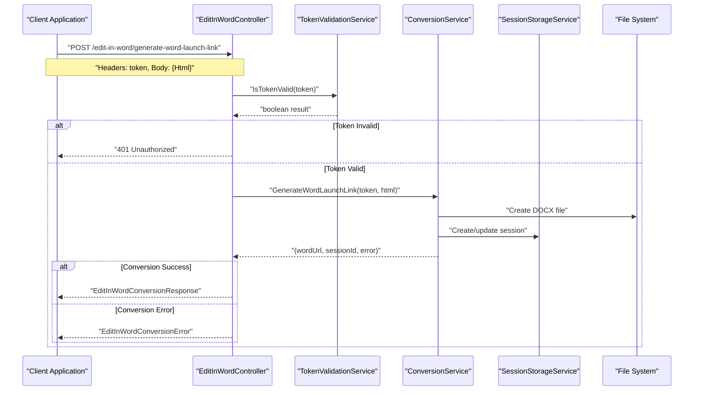
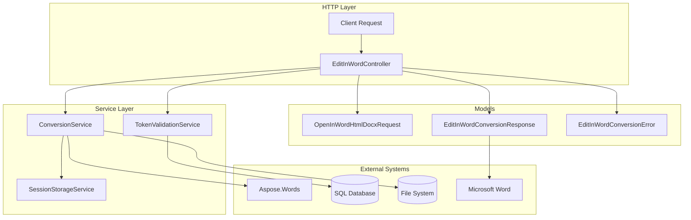

# Word Integration API

<details>
<summary>Relevant source files</summary>

The following files were used as context for generating this wiki page:

- [Controllers/EditInWordController.cs](Controllers/EditInWordController.cs)
- [Models/EditInWordConversionResponse.cs](Models/EditInWordConversionResponse.cs)
- [Models/OpenInWordHtmlDocxRequest.cs](Models/OpenInWordHtmlDocxRequest.cs)

</details>


This section documents the REST API endpoints provided by `EditInWordController` for integrating HTML content with Microsoft Word. The Word Integration API enables clients to convert HTML content into DOCX files and generate launch links that open the documents directly in Microsoft Word for editing.

The Word Integration API is part of the broader HTTP API Reference. For document conversion endpoints, see [Document Conversion API](#3.1). For real-time collaboration features during Word editing, see [Real-time Communication](#5).

## Purpose and Scope

The Word Integration API serves as the entry point for workflows where users need to edit HTML content in Microsoft Word. It handles:

- Converting HTML to DOCX format
- Generating `ms-word://` protocol launch URLs
- Creating and managing editing sessions
- Token-based authentication for secure access

The API works in conjunction with the WebSocket communication system to enable real-time synchronization between Word and web clients during editing sessions.

## API Endpoint Overview

The `EditInWordController` provides a single REST endpoint for Word integration workflows:

| Method | Endpoint | Purpose |
|--------|----------|---------|
| POST | `/edit-in-word/generate-word-launch-link` | Convert HTML to DOCX and generate Word launch link |

Sources: [Controllers/EditInWordController.cs:10-11](), [Controllers/EditInWordController.cs:25]()

## Generate Word Launch Link

### Endpoint Details

**POST** `/edit-in-word/generate-word-launch-link`

Converts provided HTML content into a DOCX file and returns a launch link to open it in Microsoft Word.

### Authentication

Requires a valid authentication token passed in the request header:

```
Header: token: <authentication-token>
```

Token validation is performed using `TokenValidationService` before processing the request.

Sources: [Controllers/EditInWordController.cs:31](), [Controllers/EditInWordController.cs:35-36]()

### Request Model

The endpoint expects a JSON request body conforming to `OpenInWordHtmlDocxRequest`:

| Field | Type | Required | Description |
|-------|------|----------|-------------|
| `Html` | string | Yes | HTML content to convert to DOCX |

```json
{
  "Html": "<html><body><h1>Sample Content</h1></body></html>"
}
```

Sources: [Models/OpenInWordHtmlDocxRequest.cs:3-7]()

### Response Models

#### Success Response

On successful conversion, returns `EditInWordConversionResponse`:

| Field | Type | Description |
|-------|------|-------------|
| `Success` | boolean | Always `true` for success responses |
| `Message` | string | Human-readable success message |
| `sessionId` | string | Unique session identifier for tracking |
| `WordUrl` | string | `ms-word://` protocol URL to launch Word |

```json
{
  "Success": true,
  "Message": "Word link generated successfully.",
  "sessionId": "unique-session-id",
  "WordUrl": "ms-word:ofe|u|file://path/to/document.docx"
}
```

Sources: [Models/EditInWordConversionResponse.cs:3-9](), [Controllers/EditInWordController.cs:46-52]()

#### Error Response

On failure, returns `EditInWordConversionError`:

| Field | Type | Description |
|-------|------|-------------|
| `Success` | boolean | Always `false` for error responses |
| `ErrorCode` | string | Error code from `HttpErrorCodes.Codes` |
| `Message` | string | Human-readable error description |
| `sessionId` | string | Session ID if available |
| `WordUrl` | string | Null for error responses |

Sources: [Models/EditInWordConversionResponse.cs:11-18](), [Controllers/EditInWordController.cs:41]()

## API Flow Diagram

### Word Integration Request Flow



Sources: [Controllers/EditInWordController.cs:31-53]()

## Component Integration Diagram

### EditInWordController Dependencies



Sources: [Controllers/EditInWordController.cs:13-21](), [Controllers/EditInWordController.cs:17]()

## Error Handling

The Word Integration API uses structured error responses with specific error codes:

### Common Error Scenarios

| Scenario | HTTP Status | Error Code | Description |
|----------|-------------|------------|-------------|
| Invalid token | 401 | N/A | Token validation failed |
| Session creation failed | 400 | `NewSessionIsNotAllowed` | Unable to create new session |
| Missing session ID | 400 | `InvalidRequest` | Session ID is required but not provided |

### Error Code Integration

Error codes are sourced from `HttpErrorCodes.Codes` and returned in the `ErrorCode` field of error responses. For comprehensive error code documentation, see [HTTP Error Codes](#6.1).

Sources: [Controllers/EditInWordController.cs:41](), [Controllers/EditInWordController.cs:44]()

## Integration with Core Services

The `EditInWordController` orchestrates multiple core services:

### ConversionService Integration

- Delegates HTML to DOCX conversion logic
- Handles file creation and session management
- Returns Word launch URLs and session identifiers

### TokenValidationService Integration

- Validates authentication tokens before processing
- Ensures secure access to Word integration features

### SessionStorageService Integration

- Manages session lifecycle for Word editing workflows
- Stores session data for real-time collaboration features

For detailed information about these services, see [Core Services](#4).

Sources: [Controllers/EditInWordController.cs:13-15](), [Controllers/EditInWordController.cs:38]()