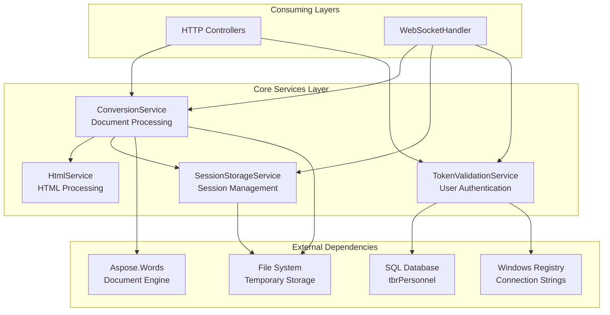
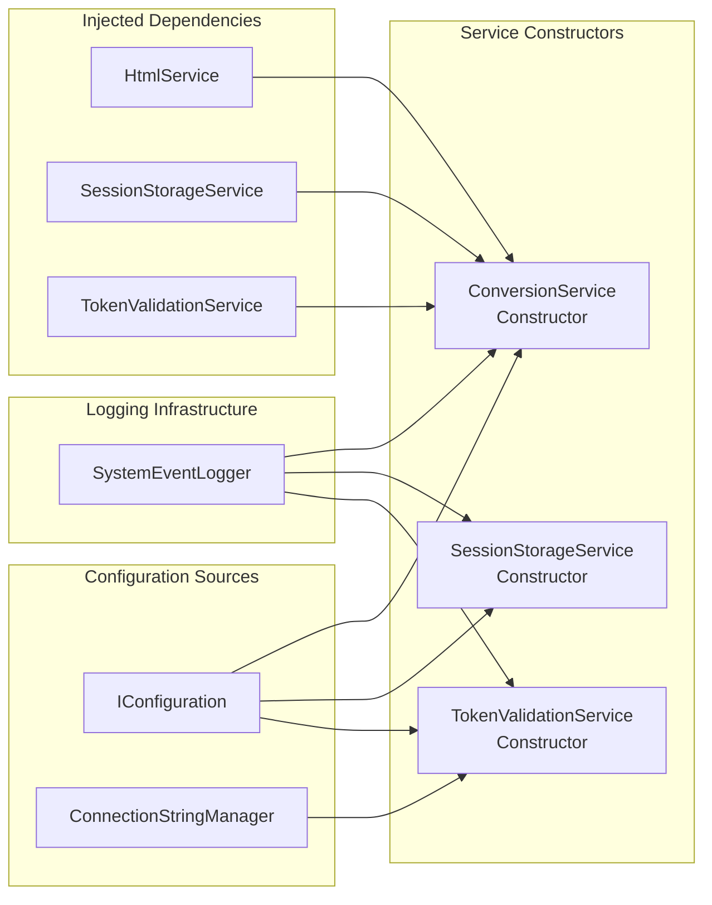
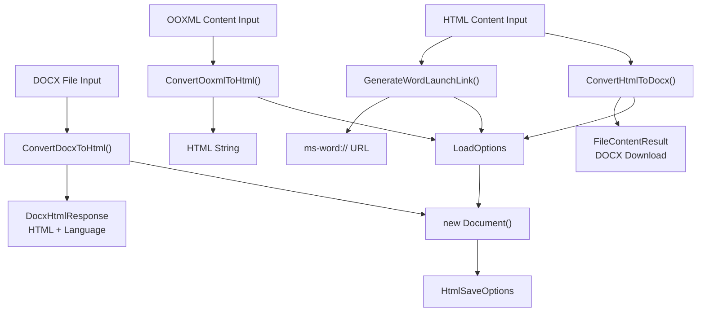
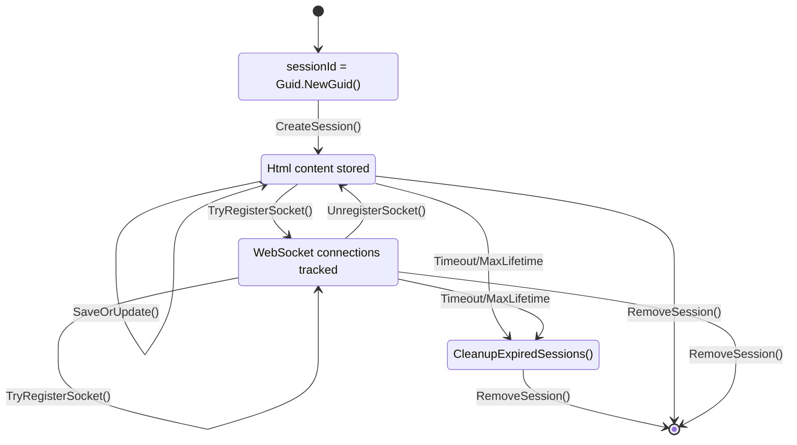
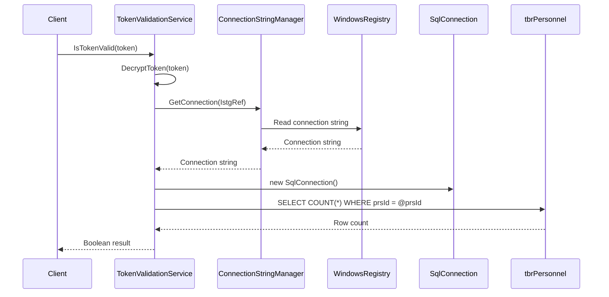

# Core Services

Relevant source files

The following files were used as context for generating this wiki page:

- [Services/ConversionService.cs](Services/ConversionService.cs)
- [Services/SessionStorageService.cs](Services/SessionStorageService.cs)
- [Services/TokenValidationService.cs](Services/TokenValidationService.cs)

Core Services represent the business logic layer of the IstgHtmlDocxConvertService, providing the fundamental operations for document conversion, session management, and authentication. These services are injected into controllers and WebSocket handlers to enable both HTTP API endpoints and real-time communication features.

This page covers the three primary service classes that form the backbone of the system. For information about HTTP API endpoints that use these services, see [HTTP API Reference](#3). For details about WebSocket communication that relies on these services, see [Real-time Communication](#5).

## Service Architecture Overview

The core services work together to provide a complete document collaboration platform. The following diagram shows the relationships between services and their primary responsibilities:

**Core Services Architecture**

Sources: [Services/ConversionService.cs:1-230](), [Services/SessionStorageService.cs:1-241](), [Services/TokenValidationService.cs:1-46]()

## Service Dependencies and Injection

All core services are configured through dependency injection and rely on common infrastructure components. The following diagram maps the dependency injection relationships to actual code entities:

**Dependency Injection Mapping**

Sources: [Services/ConversionService.cs:24-36](), [Services/SessionStorageService.cs:18-26](), [Services/TokenValidationService.cs:11-16]()

## ConversionService

The `ConversionService` class handles all document format conversions using the Aspose.Words library. It provides methods for converting between HTML and DOCX formats, generating Word launch links, and processing OOXML content from Word applications.

### Key Methods

| Method | Purpose | Return Type |
|--------|---------|-------------|
| `ConvertHtmlToDocx` | Converts HTML content to downloadable DOCX file | `IActionResult` |
| `ConvertDocxToHtml` | Converts uploaded DOCX file to HTML content | `IActionResult` |
| `GenerateWordLaunchLink` | Creates DOCX file with embedded session data and returns `ms-word://` URL | `(string?, string?, string?)` |
| `ConvertOoxmlToHtml` | Processes OOXML from Word and converts to HTML | `(string?, string?)` |

### Configuration Dependencies

The service requires several configuration values that are injected during construction:

- `TempFilesFolderPath`: Directory for storing temporary DOCX files
- `PublicHostingFolderUrl`: Base URL for publicly accessible files used in Word launch links

Sources: [Services/ConversionService.cs:31-32]()

### Document Processing Flow

**ConversionService Method Flow**

Sources: [Services/ConversionService.cs:41-74](), [Services/ConversionService.cs:79-132](), [Services/ConversionService.cs:138-181](), [Services/ConversionService.cs:183-222]()

## SessionStorageService

The `SessionStorageService` manages user sessions using a thread-safe `ConcurrentDictionary<string, HtmlSession>` for in-memory storage. Each session tracks HTML content, WebSocket connections, file paths, and timing information.

### Session Data Structure

The service stores `HtmlSession` objects containing:

| Property | Type | Purpose |
|----------|------|---------|
| `UserId` | `string` | User identifier from token |
| `SessionId` | `string` | Unique session identifier |
| `Html` | `string` | Current HTML content |
| `ClientSocket` | `WebSocket` | Browser WebSocket connection |
| `WordSocket` | `WebSocket` | Word application WebSocket connection |
| `WordFilePath` | `string` | Path to temporary DOCX file |
| `CreatedAt` | `DateTime` | Session creation timestamp |
| `LastUpdated` | `DateTime` | Last content update timestamp |
| `LastUserInteraction` | `DateTime` | Last user activity timestamp |

### Configuration Parameters

| Setting | Default | Purpose |
|---------|---------|---------|
| `SessionTTLMinutes` | 30 | Session timeout for inactivity |
| `MaxSessionLifetimeMinutes` | 120 | Absolute session lifetime limit |
| `MaxSessions` | 2 | Maximum sessions per user |

Sources: [Services/SessionStorageService.cs:22-25]()

### Session Lifecycle Management

**Session Storage Operations**

Sources: [Services/SessionStorageService.cs:27-45](), [Services/SessionStorageService.cs:89-110](), [Services/SessionStorageService.cs:181-208]()

## TokenValidationService

The `TokenValidationService` provides user authentication by validating tokens against the personnel database. It integrates with the Windows Registry for database connection management.

### Authentication Process

The service follows this validation flow:

1. **Token Decryption**: `DecryptToken()` processes the encrypted token [Services/TokenValidationService.cs:42-45]()
2. **Database Query**: Checks `tbrPersonnel` table for user existence [Services/TokenValidationService.cs:27-28]()
3. **Connection Management**: Uses `ConnectionStringManager` with registry-based configuration [Services/TokenValidationService.cs:14]()

### Database Integration

**Token Validation Flow**

Sources: [Services/TokenValidationService.cs:18-39]()

### Error Handling and Logging

The service implements comprehensive error handling with event logging for authentication failures. All exceptions during token validation are caught and logged through the `SystemEventLogger`, returning `false` for invalid authentication attempts.

Sources: [Services/TokenValidationService.cs:34-38]()