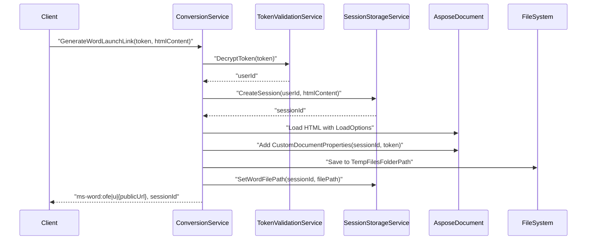
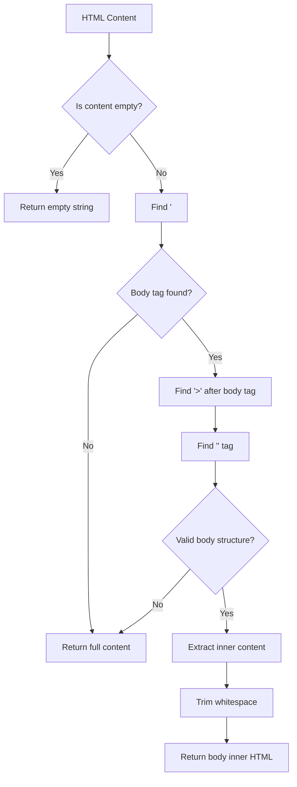

# Document Conversion Services

<details>
<summary>Relevant source files</summary>

The following files were used as context for generating this wiki page:

- [Services/ConversionService.cs](Services/ConversionService.cs)
- [Services/HtmlService.cs](Services/HtmlService.cs)

</details>


## Purpose and Scope

This document describes the core document conversion services that power the bidirectional conversion between HTML and DOCX formats. The services covered include the `ConversionService` class for document format conversion and the `HtmlService` class for HTML content processing.

For information about session management during conversions, see [Session Management](#4.2). For details about authentication during conversion requests, see [Authentication Service](#4.3). For WebSocket-based real-time document synchronization, see [Real-time Communication](#5).

## ConversionService Overview

The `ConversionService` class serves as the primary engine for document format conversion, utilizing the Aspose.Words library to transform documents between HTML and DOCX formats. This service supports three main conversion workflows:

| Conversion Type | Input Format | Output Format | Use Case |
|---|---|---|---|
| HTML to DOCX | HTML string | DOCX file download | Document export |
| DOCX to HTML | DOCX file bytes | HTML string | Document import |
| HTML to Word Launch | HTML string | ms-word:// URL + session | Live editing workflow |

**Core Dependencies:**
- `HtmlService` for HTML content processing
- `SessionStorageService` for session management
- `TokenValidationService` for authentication
- `SystemEventLogger` for logging operations
- Aspose.Words library for document engine functionality

Sources: [Services/ConversionService.cs:1-36]()

## Document Conversion Architecture

```mermaid
graph TB
    subgraph "ConversionService Methods"
        ConvertHtmlToDocx["ConvertHtmlToDocx()"]
        ConvertDocxToHtml["ConvertDocxToHtml()"] 
        GenerateWordLaunchLink["GenerateWordLaunchLink()"]
        ConvertOoxmlToHtml["ConvertOoxmlToHtml()"]
    end
    
    subgraph "Aspose.Words Engine"
        Document["Document"]
        LoadOptions["LoadOptions"]
        HtmlSaveOptions["HtmlSaveOptions"]
        SaveFormat["SaveFormat"]
    end
    
    subgraph "Supporting Services"
        HtmlService["HtmlService.ExtractBodyInnerHtml()"]
        SessionStorageService["SessionStorageService.CreateSession()"]
        TokenValidationService["TokenValidationService.DecryptToken()"]
        SystemEventLogger["SystemEventLogger"]
    end
    
    subgraph "External Systems"
        TempFilesFolderPath["TempFilesFolderPath"]
        PublicHostingFolderUrl["PublicHostingFolderUrl"]
        MSWordApp["ms-word:// Protocol"]
    end
    
    ConvertHtmlToDocx --> Document
    ConvertDocxToHtml --> Document
    ConvertDocxToHtml --> HtmlSaveOptions
    ConvertDocxToHtml --> HtmlService
    
    GenerateWordLaunchLink --> Document
    GenerateWordLaunchLink --> SessionStorageService
    GenerateWordLaunchLink --> TokenValidationService
    GenerateWordLaunchLink --> TempFilesFolderPath
    GenerateWordLaunchLink --> PublicHostingFolderUrl
    GenerateWordLaunchLink --> MSWordApp
    
    ConvertOoxmlToHtml --> Document
    ConvertOoxmlToHtml --> LoadOptions
    ConvertOoxmlToHtml --> HtmlSaveOptions
    ConvertOoxmlToHtml --> HtmlService
    
    Document --> SaveFormat
    
    ConvertHtmlToDocx --> SystemEventLogger
    ConvertDocxToHtml --> SystemEventLogger
    GenerateWordLaunchLink --> SystemEventLogger
    ConvertOoxmlToHtml --> SystemEventLogger
```



Sources: [Services/ConversionService.cs:41-229]()

## HTML to DOCX Conversion

The `ConvertHtmlToDocx` method transforms HTML content into a downloadable DOCX file using the following process:

1. **Input Validation**: Validates that HTML content is not null or empty
2. **Document Loading**: Creates Aspose `Document` with `LoadOptions` configured for HTML format and UTF-8 encoding
3. **Memory Processing**: Converts HTML string to `MemoryStream` for processing
4. **DOCX Generation**: Saves document using `SaveFormat.Docx` to output stream
5. **File Response**: Returns `FileContentResult` with MIME type `application/vnd.openxmlformats-officedocument.wordprocessingml.document`

**Key Configuration:**
- Default filename: `Document.docx`
- Encoding: UTF-8 with `CodePagesEncodingProvider.Instance` registration
- Asynchronous processing using `Task.Run()`

Sources: [Services/ConversionService.cs:41-74]()

## DOCX to HTML Conversion

The `ConvertDocxToHtml` method processes uploaded DOCX files and returns structured HTML content:

1. **File Validation**: Ensures DOCX byte array is valid and non-empty
2. **Document Loading**: Creates Aspose `Document` from DOCX stream
3. **HTML Options Configuration**: Uses `HtmlSaveOptions` with:
   - `ExportImagesAsBase64 = true` for embedded images
   - `ExportHeadersFootersMode = PerSection` for complete document structure
   - `PrettyFormat = true` for readable output
4. **Content Processing**: Extracts body content using `HtmlService.ExtractBodyInnerHtml()`
5. **Response Format**: Returns `DocxHtmlResponse` with HTML content and language metadata

**Response Structure:**
```csharp
{
    "html": "extracted_body_content",
    "document_language": "fa-IR"
}
```

Sources: [Services/ConversionService.cs:79-132]()

## Word Launch Link Generation

The `GenerateWordLaunchLink` method creates a complete workflow for editing HTML content in Microsoft Word:



**Process Steps:**
1. **Authentication**: Decrypts token to extract user ID
2. **Session Creation**: Generates new session with HTML content
3. **Document Preparation**: Embeds `sessionId` and `token` as custom document properties
4. **File Storage**: Saves DOCX to configured `TempFilesFolderPath` with GUID filename
5. **URL Construction**: Creates `ms-word:ofe|u|{publicUrl}` launch link

**Configuration Dependencies:**
- `TempFilesFolderPath`: Local storage path for temporary DOCX files
- `PublicHostingFolderUrl`: Base URL for publicly accessible files

Sources: [Services/ConversionService.cs:138-181]()

## OOXML to HTML Conversion

The `ConvertOoxmlToHtml` method handles real-time document updates from Microsoft Word by processing OOXML (Office Open XML) content:

**Processing Configuration:**
- **Load Format**: `LoadFormat.FlatOpc` for OOXML content
- **HTML Options**: Optimized for real-time updates with:
  - `MemoryOptimization = true`
  - `ImageResolution = 300`
  - `ExportImagesAsBase64 = true`
  - `UseAntiAliasing = true`

**Usage Context**: This method is primarily used by WebSocket handlers to convert Word document changes into HTML for browser synchronization.

Sources: [Services/ConversionService.cs:183-222]()

## HtmlService

The `HtmlService` class provides specialized HTML content processing functionality, focusing on extracting meaningful content from full HTML documents.

### ExtractBodyInnerHtml Method

The core method `ExtractBodyInnerHtml` performs surgical extraction of content from the HTML `<body>` element:



**Algorithm Details:**
1. **Case-Insensitive Search**: Converts to lowercase for tag detection
2. **Boundary Detection**: Locates opening `>` and closing `</body>` positions
3. **Content Extraction**: Uses `Substring()` to extract content between boundaries
4. **Whitespace Trimming**: Removes leading/trailing whitespace from result

**Error Handling**: Returns original content if body structure is incomplete or malformed.

Sources: [Services/HtmlService.cs:1-34]()

## Integration Points

The document conversion services integrate with several other system components:

| Service Integration | Purpose | Method Usage |
|---|---|---|
| Session Management | Track conversion sessions | `CreateSession()`, `SetWordFilePath()` |
| Authentication | Validate user tokens | `DecryptToken()` |
| WebSocket Communication | Real-time document sync | `ConvertOoxmlToHtml()` |
| Error Handling | Log conversion events | `SystemEventLogger` methods |
| File System | Temporary file storage | Configuration-based paths |

**Configuration Requirements:**
- `TempFilesFolderPath`: Directory for temporary DOCX files
- `PublicHostingFolderUrl`: Base URL for file access
- Aspose.Words licensing and encoding providers

Sources: [Services/ConversionService.cs:24-36](), [Services/HtmlService.cs:1-34]()