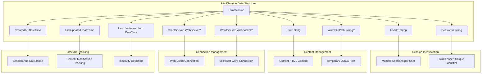
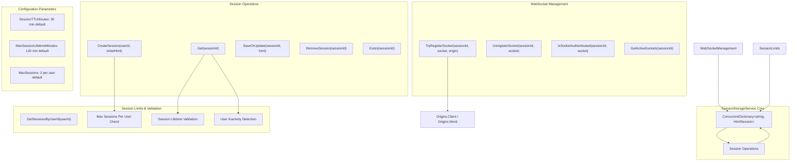
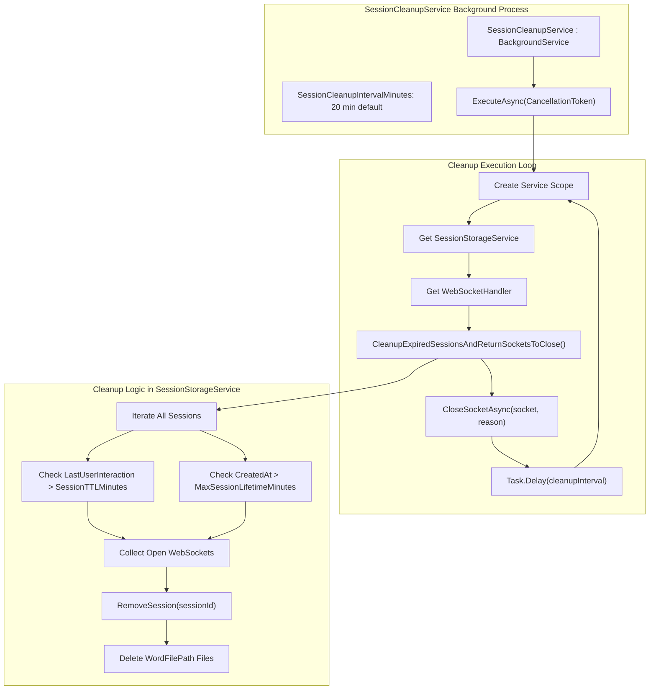

# Session Management

Relevant source files

The following files were used as context for generating this wiki page:

- [Models/HtmlSession.cs](Models/HtmlSession.cs)
- [Services/SessionCleanupService.cs](Services/SessionCleanupService.cs)
- [Services/SessionStorageService.cs](Services/SessionStorageService.cs)

This section covers the session management system that tracks user sessions, stores HTML content, manages WebSocket connections, and handles session lifecycle including automatic cleanup. The session management system enables real-time collaboration between web clients and Microsoft Word applications by maintaining session state and managing associated resources.

For authentication and token validation that controls access to sessions, see [Authentication Service](#4.3). For WebSocket communication that uses these sessions, see [Real-time Communication](#5).

## Session Data Model

The session system is built around the `HtmlSession` model, which represents a single user session and its associated resources:

**Sources:** [Models/HtmlSession.cs:1-17]()

## Session Storage Architecture

The `SessionStorageService` provides thread-safe session management using in-memory storage with configurable limits and timeouts:

**Sources:** [Services/SessionStorageService.cs:10-241]()

## Session Lifecycle Management

The session lifecycle includes creation, active use, expiration detection, and cleanup:

```mermaid
graph LR
    subgraph "Session Creation"
        CreateRequest["Create Session Request"]
        UserThrottle["Check Max Sessions per User"]
        GenerateGUID["Generate GUID SessionId"]
        InitializeSession["Initialize HtmlSession Object"]
        StoreSession["Store in ConcurrentDictionary"]
    end
    
    subgraph "Active Session Usage"
        RegisterSockets["Register Client/Word WebSockets"]
        UpdateContent["Update HTML Content"]
        TrackInteraction["Update LastUserInteraction"]
        FileOperations["Manage WordFilePath"]
    end
    
    subgraph "Expiration Detection"
        InactivityExpiry["LastUserInteraction + SessionTTLMinutes"]
        AbsoluteExpiry["CreatedAt + MaxSessionLifetimeMinutes"]
        ExpiryCondition["isInactive || isTooOld"]
    end
    
    subgraph "Session Cleanup"
        CloseWebSockets["Close Active WebSockets"]
        DeleteTempFiles["Delete WordFilePath Files"]
        RemoveFromStorage["Remove from ConcurrentDictionary"]
    end
    
    CreateRequest --> UserThrottle
    UserThrottle --> GenerateGUID
    GenerateGUID --> InitializeSession
    InitializeSession --> StoreSession
    
    StoreSession --> RegisterSockets
    RegisterSockets --> UpdateContent
    UpdateContent --> TrackInteraction
    TrackInteraction --> FileOperations
    
    FileOperations --> InactivityExpiry
    InactivityExpiry --> ExpiryCondition
    AbsoluteExpiry --> ExpiryCondition
    ExpiryCondition --> CloseWebSockets
    CloseWebSockets --> DeleteTempFiles
    DeleteTempFiles --> RemoveFromStorage
```

**Sources:** [Services/SessionStorageService.cs:27-45](), [Services/SessionStorageService.cs:47-59](), [Services/SessionStorageService.cs:181-208]()

## Background Session Cleanup

The `SessionCleanupService` runs as a background service to automatically clean up expired sessions:

**Sources:** [Services/SessionCleanupService.cs:1-35](), [Services/SessionStorageService.cs:181-208]()

## Configuration Options

The session management system supports several configuration parameters that can be set in application configuration:

| Configuration Key | Default Value | Description | Usage Location |
|------------------|---------------|-------------|----------------|
| `SessionTTLMinutes` | 30 | Session timeout after user inactivity | [Services/SessionStorageService.cs:22]() |
| `MaxSessionLifetimeMinutes` | 120 | Maximum absolute session lifetime | [Services/SessionStorageService.cs:23]() |
| `MaxSessions` | 2 | Maximum sessions per user | [Services/SessionStorageService.cs:24]() |
| `SessionCleanupIntervalMinutes` | 20 | Background cleanup frequency | [Services/SessionCleanupService.cs:13]() |

## WebSocket Integration

Sessions maintain references to WebSocket connections for real-time communication:

```mermaid
graph LR
    subgraph "Socket Registration Process"
        SocketConnect["WebSocket Connection"]
        ValidateSession["Validate SessionId"]
        CheckOrigin["Determine Origin: Client/Word"]
        RegisterSocket["TryRegisterSocket(sessionId, socket, origin)"]
        ValidateExisting["Check for Existing Socket"]
        StoreReference["Store Socket Reference in HtmlSession"]
    end
    
    subgraph "Socket Origins"
        ClientOrigin["Origins.Client"]
        WordOrigin["Origins.Word"]
        ClientSocket["HtmlSession.ClientSocket"]
        WordSocket["HtmlSession.WordSocket"]
    end
    
    subgraph "Socket Lifecycle"
        ActiveSocket["Active WebSocket Communication"]
        SocketClosed["Socket Closed/Disconnected"]
        UnregisterSocket["UnregisterSocket(sessionId, socket)"]
        ClearReference["Clear Socket Reference"]
    end
    
    SocketConnect --> ValidateSession
    ValidateSession --> CheckOrigin
    CheckOrigin --> RegisterSocket
    RegisterSocket --> ValidateExisting
    ValidateExisting --> StoreReference
    
    ClientOrigin --> ClientSocket
    WordOrigin --> WordSocket
    StoreReference --> ClientSocket
    StoreReference --> WordSocket
    
    ClientSocket --> ActiveSocket
    WordSocket --> ActiveSocket
    ActiveSocket --> SocketClosed
    SocketClosed --> UnregisterSocket
    UnregisterSocket --> ClearReference
```

**Sources:** [Services/SessionStorageService.cs:117-146](), [Services/SessionStorageService.cs:148-170](), [WebSockets/Origins.cs]()

## File Management

Sessions can maintain references to temporary Word document files that are automatically cleaned up:

- **File Association**: The `SetWordFilePath` method links a temporary DOCX file to a session [Services/SessionStorageService.cs:172-178]()
- **Automatic Cleanup**: When sessions are removed, associated files are deleted from the file system [Services/SessionStorageService.cs:93-104]()
- **Error Handling**: File deletion failures are logged but do not prevent session removal [Services/SessionStorageService.cs:99-103]()

**Sources:** [Services/SessionStorageService.cs:89-110](), [Services/SessionStorageService.cs:172-178]()