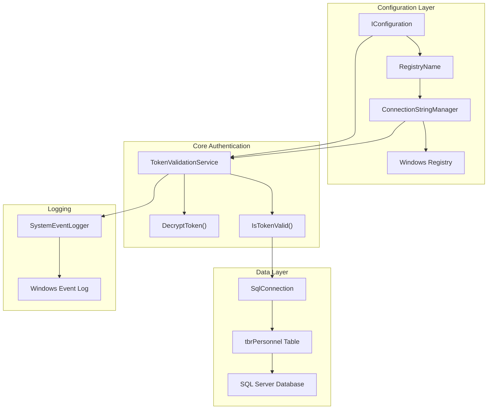
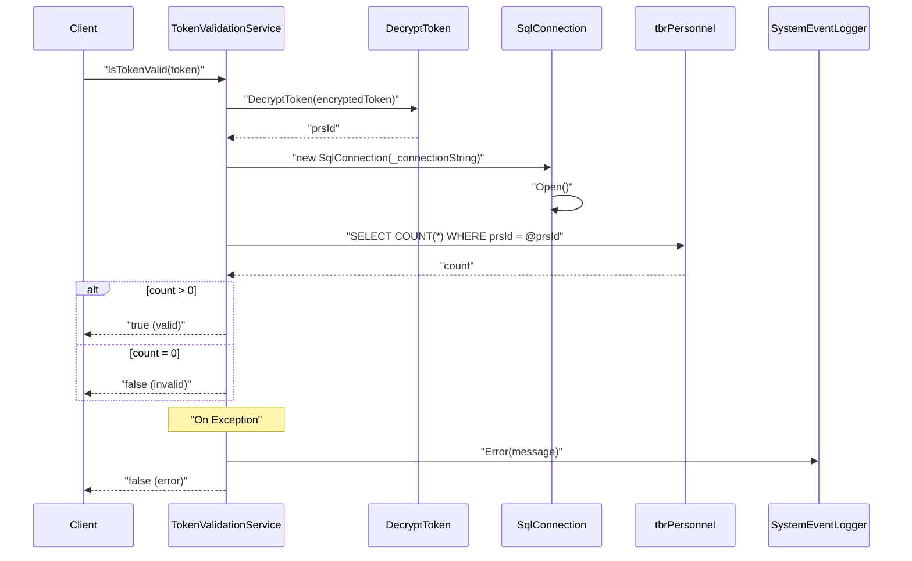

# Authentication Service

<details>
<summary>Relevant source files</summary>

The following files were used as context for generating this wiki page:

- [Services/TokenValidationService.cs](Services/TokenValidationService.cs)

</details>


The Authentication Service provides token-based user authentication for the IstgHtmlDocxConvertService. It validates user tokens against a SQL Server database and integrates with the Windows Registry for connection string management. This service is used by both HTTP endpoints and WebSocket handlers to authenticate users before allowing access to document conversion and collaboration features.

For session management after authentication, see [Session Management](#4.2). For WebSocket authentication flows, see [WebSocket Protocol](#5.2).

## Architecture Overview

The authentication system is built around the `TokenValidationService` class, which handles token decryption and database validation. The service integrates with external dependencies including Windows Registry for configuration and SQL Server for user data.

### Authentication Service Dependencies



Sources: [Services/TokenValidationService.cs:1-46]()

## Token Validation Process

The authentication flow follows a multi-step process involving token decryption, database lookup, and error handling. The service validates tokens by extracting user identifiers and verifying them against the personnel database.

### Token Validation Flow



Sources: [Services/TokenValidationService.cs:18-39]()

### Token Validation Implementation

The `IsTokenValid` method implements the core authentication logic:

| Step | Action | Code Reference |
|------|--------|----------------|
| 1 | Decrypt token to extract `prsId` | [Services/TokenValidationService.cs:22]() |
| 2 | Open SQL connection using connection string | [Services/TokenValidationService.cs:24-25]() |
| 3 | Execute parameterized query against `tbrPersonnel` | [Services/TokenValidationService.cs:27-28]() |
| 4 | Return validation result based on record count | [Services/TokenValidationService.cs:30-32]() |
| 5 | Log errors and return false on exceptions | [Services/TokenValidationService.cs:34-38]() |

The validation query specifically targets the `tbrPersonnel` table:
```sql
SELECT COUNT(*) FROM ..[dbo].[tbrPersonnel] WHERE prsId = @prsId
```

Sources: [Services/TokenValidationService.cs:27]()

## Database Integration

The authentication service connects to SQL Server through a connection string retrieved from the Windows Registry. This approach provides secure, centralized configuration management for database connectivity.

### Connection String Management

The service uses the `ConnectionStringManager` from the `istgOfficeAutomationBrl.RegManager` namespace to retrieve database connection strings:

| Component | Purpose | Implementation |
|-----------|---------|----------------|
| `RegistryName` | Registry key identifier from appsettings | [Services/TokenValidationService.cs:13]() |
| `ConnectionStringManager` | Retrieves connection strings from Registry | [Services/TokenValidationService.cs:14]() |
| `IstgDataBase.IstgRef` | Database reference identifier | [Services/TokenValidationService.cs:14]() |
| `_connectionString` | Cached connection string for SQL operations | [Services/TokenValidationService.cs:9,14]() |

### Personnel Database Schema

The authentication validates against the `tbrPersonnel` table with the following structure:

| Field | Type | Purpose |
|-------|------|---------|
| `prsId` | Primary Key | Personnel identifier extracted from decrypted token |

Sources: [Services/TokenValidationService.cs:11-16](), [Services/TokenValidationService.cs:27]()

## Token Decryption

The service includes a placeholder implementation for token decryption that currently returns the token unchanged. This suggests the actual decryption logic is intended to be implemented based on specific security requirements.

```csharp
public string DecryptToken(string encryptedToken)
{
    return encryptedToken;
}
```

In a production environment, this method should implement proper token decryption to extract the `prsId` from encrypted tokens.

Sources: [Services/TokenValidationService.cs:42-45]()

## Error Handling and Logging

The authentication service implements comprehensive error handling with logging to the Windows Event Log through the `SystemEventLogger`.

### Error Handling Strategy

| Error Scenario | Response | Logging |
|----------------|----------|---------|
| Token decryption failure | Return `false` | Error logged with exception details |
| Database connection failure | Return `false` | Error logged with exception details |
| SQL query execution failure | Return `false` | Error logged with exception details |
| Invalid user (count = 0) | Return `false` | No error logged (valid scenario) |

The error logging format includes contextual information:
```
"Something went wrong in Token validation: {ex.Message}"
```

Sources: [Services/TokenValidationService.cs:34-38]()

## Dependency Injection Configuration

The `TokenValidationService` is configured through the dependency injection container with the following dependencies:

| Dependency | Type | Purpose |
|------------|------|---------|
| `IConfiguration` | Interface | Access to application configuration |
| `SystemEventLogger` | Service | Error and event logging |

The constructor initializes the connection string during service instantiation, ensuring database connectivity is established at startup.

Sources: [Services/TokenValidationService.cs:11-16]()